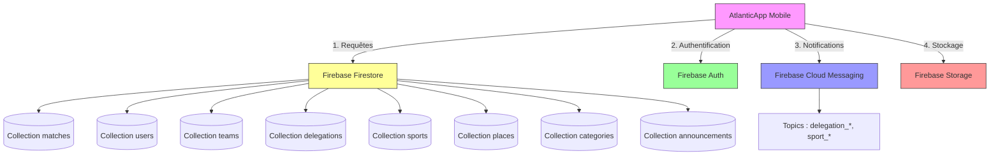
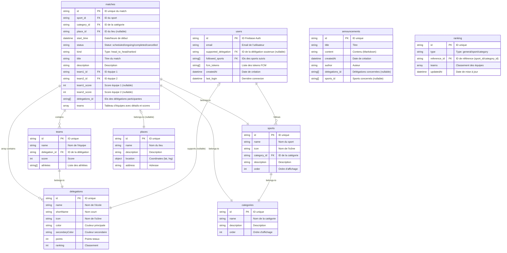

# 🔥 Backend : Firebase - AtlanticApp

> *Comprendre l'architecture backend : Firestore, Auth, Cloud Messaging et leur intégration avec React Native.*

---

## 📖 **Sommaire**

1. [Architecture Globale Firebase](#-architecture-globale-firebase)
2. [Firestore - Base de données](#-firestore---base-de-données)
3. [Authentification](#-authentification)
4. [Cloud Messaging (FCM)](#-cloud-messaging-fcm)
5. [Cloud Functions](#-cloud-functions)
6. [Exemples de Code Complets](#-exemples-de-code-complets)
7. [Bonnes Pratiques](#-bonnes-pratiques)

---

**[← Retour à l'accueil](./Home.md) | [Structure du Projet →](./Project-Structure.md)**

---

## 🏗️ **Architecture Globale Firebase**

AtlanticApp utilise **Firebase** comme backend complet (Backend-as-a-Service). Voici les services utilisés :



---

## 🗃️ **Firestore - Base de données**

> *Firestore est une **base de données NoSQL** en temps réel de Google. Elle stocke les données dans des **collections** contenant des **documents**.*

### 📊 **Schéma des Collections**

Voici la structure complète des données dans Firestore pour AtlanticApp :



---

### 📋 **Structure d'un Document Match (exemple)**

```json
{
  "id": "match_abc123",
  "sport_id": "sport_football",
  "category_id": "category_men",
  "place_id": "place_stadium_1",
  "start_time": {
    "_seconds": 1718234800,
    "_nanoseconds": 0
  },
  "status": "scheduled",
  "kind": "head_to_head",
  "title": "Football - Phase de poules",
  "description": "Match entre IMT Atlantique et CentraleSupélec",
  "team1_id": "team_imt_football",
  "team2_id": "team_centrale_football",
  "team1_score": null,
  "team2_score": null,
  "delegations_id": ["delegation_imt", "delegation_centrale"],
  "teams": [
    {
      "id": "team_imt_football",
      "name": "IMT Atlantique",
      "delegation_id": "delegation_imt",
      "score": null,
      "color": "#1d4966",
      "icon": "imt-logo"
    },
    {
      "id": "team_centrale_football",
      "name": "CentraleSupélec",
      "delegation_id": "delegation_centrale",
      "score": null,
      "color": "#ff0000",
      "icon": "centrale-logo"
    }
  ],
  "createdAt": {
    "_seconds": 1718234000,
    "_nanoseconds": 0
  }
}
```

---

### 📁 **Structure d'un Document User (exemple)**

```json
{
  "id": "user_xyz789",
  "email": "etudiant@imt-atlantique.fr",
  "supported_delegation": "delegation_imt",
  "followed_sports": ["sport_football", "sport_rugby", "sport_volleyball"],
  "fcm_tokens": [
    "cLQ2aBcD...",
    "eFg3hIjK..."
  ],
  "createdAt": {
    "_seconds": 1718234000,
    "_nanoseconds": 0
  },
  "last_login": {
    "_seconds": 1718320400,
    "_nanoseconds": 0
  }
}
```

---

### 🔧 **Opérations CRUD avec Firestore**

#### 📖 **Lire des données (Read)**

```typescript
import { getFirestore, collection, getDocs, query, where, orderBy, limit } from "@react-native-firebase/firestore";

const db = getFirestore();

// 1. Lire tous les matchs
const getAllMatches = async () => {
  const querySnapshot = await getDocs(collection(db, "matches"));
  const matches = [];
  
  querySnapshot.forEach((doc) => {
    matches.push({
      id: doc.id,
      ...doc.data(),
      start_time: doc.data().start_time?.toDate()  // ⚠️ Conversion Timestamp
    });
  });
  
  return matches;
};

// 2. Lire avec filtres
const getMatchesBySport = async (sportId: string) => {
  const q = query(
    collection(db, "matches"),
    where("sport_id", "==", sportId),
    orderBy("start_time", "asc")
  );
  
  const querySnapshot = await getDocs(q);
  // ... traitement
};

// 3. Lire un document spécifique
const getMatchById = async (matchId: string) => {
  const docRef = doc(db, "matches", matchId);
  const docSnap = await getDoc(docRef);
  
  if (docSnap.exists) {
    return {
      id: docSnap.id,
      ...docSnap.data(),
      start_time: docSnap.data().start_time?.toDate()
    };
  } else {
    throw new Error("Match non trouvé");
  }
};
```

#### ✏️ **Écrire des données (Create/Update)**

```typescript
import { doc, setDoc, updateDoc, addDoc, collection } from "@react-native-firebase/firestore";

// 1. Créer un nouveau match
const createMatch = async (matchData: Match) => {
  const docRef = await addDoc(collection(db, "matches"), matchData);
  return docRef.id;
};

// 2. Mettre à jour un match (avec merge pour ne pas écraser)
const updateMatch = async (matchId: string, updates: Partial<Match>) => {
  const matchRef = doc(db, "matches", matchId);
  await updateDoc(matchRef, updates);
};

// 3. Créer/écrire un document avec un ID spécifique
const setMatch = async (matchId: string, matchData: Match) => {
  const matchRef = doc(db, "matches", matchId);
  await setDoc(matchRef, matchData, { merge: true });  // merge: true = fusionne avec existant
};
```

#### 🗑️ **Supprimer des données (Delete)**

```typescript
import { doc, deleteDoc } from "@react-native-firebase/firestore";

const deleteMatch = async (matchId: string) => {
  const matchRef = doc(db, "matches", matchId);
  await deleteDoc(matchRef);
};
```

---

### 🎯 **Requêtes Avancées avec Firestore**

#### 🔍 **Filtrage avec `where`**

```typescript
// Filtrer les matchs d'une délégation
const getMatchesByDelegation = async (delegationId: string) => {
  const q = query(
    collection(db, "matches"),
    where("delegations_id", "array-contains", delegationId)
  );
  return await getDocs(q);
};

// Filtrer les matchs non terminés
const getUpcomingMatches = async () => {
  const q = query(
    collection(db, "matches"),
    where("status", "not-in", ["completed", "cancelled"])
  );
  return await getDocs(q);
};

// Filtrer par date
const getMatchesAfterDate = async (date: Date) => {
  const q = query(
    collection(db, "matches"),
    where("start_time", ">=", date)
  );
  return await getDocs(q);
};
```

#### 📊 **Pagination avec `limit` et `startAfter`**

```typescript
const PAGE_SIZE = 10;

const getMatchesPage = async (lastDoc: QueryDocumentSnapshot | null = null) => {
  let q = query(
    collection(db, "matches"),
    orderBy("start_time", "asc"),
    limit(PAGE_SIZE)
  );
  
  if (lastDoc) {
    q = query(q, startAfter(lastDoc));
  }
  
  const snapshot = await getDocs(q);
  const newLastDoc = snapshot.docs[snapshot.docs.length - 1];
  
  return {
    matches: snapshot.docs.map(doc => ({ id: doc.id, ...doc.data() })),
    lastDoc: newLastDoc
  };
};
```

✅ **C'est exactement ce qui est implémenté dans `eventsService.ts` !**

#### 🔄 **Tri avec `orderBy`**

```typescript
// Tri par date (ascendant = plus ancien d'abord)
const q1 = query(
  collection(db, "matches"),
  orderBy("start_time", "asc")
);

// Tri par score (descendant = plus élevé d'abord)
const q2 = query(
  collection(db, "teams"),
  orderBy("score", "desc")
);

// ⚠️ IMPORTANT : Vous ne pouvez pas trier sur un champ qui n'est pas indexé
// Si vous obtenez une erreur, créez un index dans la console Firebase
```

#### 🔗 **Jointures avec `array-contains`**

```typescript
// Trouver les matchs où une équipe spécifique participe
const getMatchesByTeam = async (teamId: string) => {
  // Option 1: Utiliser le champ teams (si c'est un tableau d'IDs)
  const q = query(
    collection(db, "matches"),
    where("teams", "array-contains", teamId)
  );
  
  // Option 2: Utiliser team1_id ou team2_id
  const q2 = query(
    collection(db, "matches"),
    or(
      where("team1_id", "==", teamId),
      where("team2_id", "==", teamId)
    )
  );
  
  return await getDocs(q);
};
```

---

## 🔐 **Authentification (Firebase Auth)**

> *Firebase Auth gère l'authentification des utilisateurs avec plusieurs méthodes (email/mot de passe, Google, etc.).*

### 📋 **Méthodes d'Authentification Utilisées**

| Méthode | Statut | Code |
|---------|--------|------|
| Email/Mot de passe | ✅ Actif | `signInWithEmailAndPassword()` |
| Google | ❌ Non utilisé | - |
| Facebook | ❌ Non utilisé | - |
| Apple | ❌ Non utilisé | - |
| Anonyme | ❌ Non utilisé | - |

### 🔧 **Fonctions Principales dans `authService.ts`**

```typescript
import auth from '@react-native-firebase/auth';
import { exportFcmToken, removeFcmToken } from './messaging/fcmService';
import { setLocalFavoriteDelegation, setLocalSupportedSports } from './storage';
import { subscribeToDelegation, subscribeToSports } from './messaging/fcmService';

// 🔹 Connexion
export const logIn = async (email: string, password: string) => {
  try {
    // 1. Authentification Firebase
    const userCredential = await auth().signInWithEmailAndPassword(email, password);
    
    // 2. Enregistre le token FCM pour les notifications
    await exportFcmToken();
    
    // 3. Met à jour la date de dernière connexion
    await updateUser(userCredential.user.uid, { 
      last_login: new Date() 
    });
    
    // 4. Synchronise les préférences utilisateur
    const userData = await getUserFromUid(userCredential.user.uid);
    
    await setLocalFavoriteDelegation(userData.supported_delegation);
    await subscribeToDelegation(userData.supported_delegation);
    
    await setLocalSupportedSports(userData.followed_sports);
    await subscribeToSports(userData.followed_sports);
    
    return userCredential.user.uid;
  } catch (error) {
    console.error('Error logging in:', error);
    return null;
  }
};

// 🔹 Déconnexion
export const logOut = async () => {
  // 1. Supprime le token FCM
  await removeFcmToken();
  
  // 2. Déconnexion Firebase
  await auth().signOut();
};
```

### 📝 **Gestion des Utilisateurs**

```typescript
// Écouter les changements d'état d'authentification
import { onAuthStateChanged } from '@react-native-firebase/auth';

const unsubscribe = onAuthStateChanged(auth(), (user) => {
  if (user) {
    // Utilisateur connecté
    console.log('User is signed in:', user.uid);
  } else {
    // Aucun utilisateur connecté
    console.log('No user signed in');
  }
});

// N'oubliez pas de vous désabonner
unsubscribe();
```

### 🔒 **Récupération du Mot de Passe**

```typescript
import auth from '@react-native-firebase/auth';

const resetPassword = async (email: string) => {
  try {
    await auth().sendPasswordResetEmail(email);
    console.log('Email de réinitialisation envoyé');
  } catch (error) {
    console.error('Erreur:', error.message);
  }
};
```

---

## 📬 **Cloud Messaging (FCM) - Notifications**

> *Firebase Cloud Messaging permet d'envoyer des **notifications push** aux utilisateurs.*

### 📡 **Concepts Clés**

| Concept | Description | Exemple |
|---------|-------------|---------|
| **Token FCM** | Identifiant unique de l'appareil | `cLQ2aBcD...` |
| **Topic** | Canal de notification | `delegation_imt`, `sport_football` |
| **Message** | Notification envoyée | `{ title: "Nouveau match", body: "IMT vs Centrale" }` |
| **Payload** | Données supplémentaires | `{ matchId: "abc123", sportId: "football" }` |

### 🔧 **Configuration dans le Projet**

#### 1️⃣ **Android**

Dans `android/app/build.gradle` :
```gradle
// Déjà configuré dans le projet
dependencies {
    implementation platform('com.google.firebase:firebase-bom:32.7.0')
    implementation 'com.google.firebase:firebase-messaging'
}
```

#### 2️⃣ **iOS**

Dans `ios/Podfile` :
```ruby
# Déjà configuré dans le projet
pod 'Firebase/Messaging'
```

### 📁 **Fonctions Principales dans `fcmService.ts`**

```typescript
import messaging from '@react-native-firebase/messaging';
import { Platform, PermissionsAndroid } from 'react-native';

// 🔹 Vérifier et demander les permissions
export const checkNotificationPermission = async () => {
  if (Platform.OS === 'ios') {
    await iOSPermissionRequest();
  } else if (Platform.OS === 'android') {
    await androidPermissionRequest();
  }
};

// 🔹 Requête iOS
export const iOSPermissionRequest = async () => {
  const authStatus = await messaging().requestPermission();
  const enabled = authStatus === messaging.AuthorizationStatus.AUTHORIZED ||
                  authStatus === messaging.AuthorizationStatus.PROVISIONAL;
  
  if (enabled) {
    console.log('Permission accordée:', authStatus);
  }
};

// 🔹 Requête Android
export const androidPermissionRequest = async () => {
  const authStatus = await PermissionsAndroid.request(
    PermissionsAndroid.PERMISSIONS.POST_NOTIFICATIONS
  );
  const enabled = authStatus === PermissionsAndroid.RESULTS.GRANTED;
  
  if (enabled) {
    console.log('Permission accordée');
  }
};

// 🔹 Récupérer le token FCM
export const getFcmToken = async (uid: string) => {
  if (Platform.OS === 'ios') {
    await messaging().registerDeviceForRemoteMessages();
  }
  
  const token = await messaging().getToken();
  console.log('FCM Token:', token);  // 🔍 Pour le débogage
  await saveFcmToken(uid, token);
  return token;
};

// 🔹 Sauvegarder le token dans Firestore
export const saveFcmToken = async (uid: string, fcmToken: string) => {
  await firestore().collection('users').doc(uid).set({
    fcmToken,
    createdAt: firestore.FieldValue.serverTimestamp()
  }, { merge: true });
};

// 🔹 Exporter le token (associer à l'utilisateur)
export const exportFcmToken = async () => {
  const fcmToken = await messaging().getToken();
  const currentUser = auth().currentUser;
  
  try {
    const fcmTokensList = (await getUserFromUid(currentUser.uid)).fcm_tokens;
    
    if (!fcmTokensList.includes(fcmToken)) {
      fcmTokensList.push(fcmToken);
      await updateUser(currentUser.uid, { fcm_tokens: fcmTokensList });
    }
  } catch (error) {
    console.error('Error exporting FCM token:', error);
  }
  
  return fcmToken;
};

// 🔹 Supprimer le token
export const removeFcmToken = async () => {
  const fcmToken = await messaging().getToken();
  const currentUser = auth().currentUser;
  
  try {
    const fcmTokensList = (await getUserFromUid(currentUser.uid)).fcm_tokens;
    const index = fcmTokensList.indexOf(fcmToken);
    
    if (index > -1) {
      fcmTokensList.splice(index, 1);
      await updateUser(currentUser.uid, { fcm_tokens: fcmTokensList });
    }
  } catch (error) {
    console.error('Error removing FCM token:', error);
  }
  
  return fcmToken;
};

// 🔹 S'abonner à une délégation
export const subscribeToDelegation = async (delegationId: string | null) => {
  try {
    // Se désabonne de tous les topics de délégations
    const delegationsList = await getAllDelegations();
    await Promise.all(
      delegationsList.map(delegation => 
        messaging().unsubscribeFromTopic(delegation.id)
      )
    );
    
    // S'abonne au topic sélectionné
    if (delegationId) {
      await messaging().subscribeToTopic(`${delegationId}`);
    }
  } catch (error) {
    console.error('Error subscribing to delegations:', error);
  }
};

// 🔹 S'abonner à des sports
export const subscribeToSports = async (sportsId: string[]) => {
  try {
    const sportsList = await getAllRawSports();
    
    // Se désabonne de tous les sports
    await Promise.all(
      sportsList.map(sport => 
        messaging().unsubscribeFromTopic(sport.id)
      )
    );
    
    // S'abonne aux sports sélectionnés
    await Promise.all(
      sportsId.map(id => 
        messaging().subscribeToTopic(`${id}`)
      )
    );
  } catch (error) {
    console.error('Error subscribing to sports:', error);
  }
};
```

### 📥 **Recevoir des Notifications**

Pour tester la réception des notifications :

#### 1️⃣ **En Mode Développement**

```typescript
import messaging from '@react-native-firebase/messaging';
import { useEffect } from 'react';

// À ajouter dans votre composant principal (App.tsx ou _layout.tsx)
useEffect(() => {
  // Gestionnaire pour les notifications reçues en avant-plan
  messaging().onMessage(async (remoteMessage) => {
    console.log('Notification reçue en avant-plan:', remoteMessage);
    // Affichez une alerte ou une notification locale
  });
  
  // Gestionnaire pour les notifications cliquées
  messaging().onNotificationOpenedApp((remoteMessage) => {
    console.log('Notification cliquée:', remoteMessage);
    // Naviguez vers l'écran approprié
  });
  
  // Gestionnaire pour les notifications reçues lorsque l'app est fermée
  messaging().getInitialNotification().then((remoteMessage) => {
    if (remoteMessage) {
      console.log('Notification reçue au lancement:', remoteMessage);
    }
  });
  
  return () => {
    // Nettoyage
  };
}, []);
```

#### 2️⃣ **Envoyer une Notification de Test**

1. Allez dans la **console Firebase** : [https://console.firebase.google.com](https://console.firebase.google.com)
2. Sélectionnez votre projet
3. Allez dans **Cloud Messaging** → **Nouvelle campagne**
4. Choisissez **Tester sur un appareil**
5. Entrez le **token FCM** (visible dans les logs de votre app)
6. Configurez la notification et envoyez-la

---

## ☁️ **Cloud Functions**

> *Les Cloud Functions sont des **fonctions serverless** qui s'exécutent sur les serveurs de Firebase en réponse à des événements.*

### 📋 **Fonctions Actuellement Déployées**

> *⚠️ Note : Le projet AtlanticApp n'utilise pas encore de Cloud Functions dans sa version actuelle, mais voici comment elles pourraient être implémentées.*

### 📁 **Exemples de Cloud Functions pour AtlanticApp**

#### 🎯 **Exemple 1 : Notification de Début de Match**

```javascript
// functions/index.js
const functions = require('firebase-functions');
const admin = require('firebase-admin');

admin.initializeApp();

// Déclenchée lorsque le statut d'un match passe à "ongoing"
exports.onMatchStarted = functions.firestore
  .document('matches/{matchId}')
  .onUpdate(async (change, context) => {
    const newData = change.after.data();
    const oldData = change.before.data();
    
    // Vérifie si le statut a changé vers "ongoing"
    if (newData.status === 'ongoing' && oldData.status !== 'ongoing') {
      const match = newData;
      
      // Récupère les délégations participant
      const delegationIds = match.delegations_id;
      
      // Prépare la notification
      const notification = {
        title: '⚽ Match en cours !',
        body: `${match.title} vient de commencer`,
        data: {
          matchId: context.params.matchId,
          sportId: match.sport_id,
          type: 'match_started'
        }
      };
      
      // Envoie à toutes les délégations participant
      const promises = delegationIds.map(delegationId => {
        return admin.messaging().sendToTopic(delegationId, notification);
      });
      
      await Promise.all(promises);
    }
    
    return null;
  });
```

#### 🎯 **Exemple 2 : Mise à Jour Automatique du Classement**

```javascript
// Déclenchée lorsque le score d'un match est mis à jour
exports.onMatchScoreUpdated = functions.firestore
  .document('matches/{matchId}')
  .onUpdate(async (change, context) => {
    const newData = change.after.data();
    const oldData = change.before.data();
    
    // Vérifie si le score a changé
    if (newData.team1_score !== oldData.team1_score ||
        newData.team2_score !== oldData.team2_score) {
      
      const match = newData;
      
      // Met à jour les points des équipes dans leurs délégations
      const delegationUpdates = {};
      
      if (match.team1_score !== null && match.team2_score !== null) {
        // Calcule les points (exemple : 3 pour une victoire, 1 pour un match nul)
        const team1Points = match.team1_score > match.team2_score ? 3 : 
                          match.team1_score === match.team2_score ? 1 : 0;
        const team2Points = match.team2_score > match.team1_score ? 3 : 
                          match.team1_score === match.team2_score ? 1 : 0;
        
        // Met à jour les délégations
        // ...
      }
    }
    
    return null;
  });
```

#### 🎯 **Exemple 3 : Nettoyage des Tokens FCM Invalides**

```javascript
// Fonction planifiée pour nettoyer les tokens invalides
exports.cleanupInvalidTokens = functions.pubsub
  .schedule('every 24 hours')
  .onRun(async (context) => {
    const usersRef = admin.firestore().collection('users');
    const snapshot = await usersRef.get();
    
    const promises = snapshot.docs.map(async (doc) => {
      const userData = doc.data();
      const validTokens = [];
      
      // Vérifie chaque token
      for (const token of userData.fcm_tokens || []) {
        try {
          // Teste si le token est valide
          await admin.messaging().sendToDevice(token, {
            notification: { title: 'Test', body: 'Test' },
            data: { test: 'true' }
          });
          validTokens.push(token);
        } catch (error) {
          // Token invalide, on l'ignore
          console.log(`Token invalide supprimé: ${token}`);
        }
      }
      
      // Met à jour l'utilisateur avec les tokens valides
      if (validTokens.length !== userData.fcm_tokens?.length) {
        await doc.ref.update({ fcm_tokens: validTokens });
      }
    });
    
    await Promise.all(promises);
    return null;
  });
```

### 🛠 **Déploiement des Cloud Functions**

#### 1️⃣ **Installer Firebase CLI**

```bash
npm install -g firebase-tools
```

#### 2️⃣ **Se connecter**

```bash
firebase login
```

#### 3️⃣ **Initialiser Firebase**

```bash
firebase init functions
```

#### 4️⃣ **Déployer**

```bash
# Déployer toutes les fonctions
firebase deploy --only functions

# Déployer une fonction spécifique
firebase deploy --only functions:onMatchStarted

# Déployer dans l'émulateur pour les tests
firebase emulators:start
```

---

## 💡 **Exemples de Code Complets**

### 🎯 **Exemple 1 : Récupération Paginé des Matchs (comme dans eventsService.ts)**

```typescript
import { 
  getFirestore, 
  collection, 
  getDocs, 
  query, 
  limit, 
  orderBy, 
  startAfter, 
  where 
} from "@react-native-firebase/firestore";
import { FirebaseFirestoreTypes } from '@react-native-firebase/firestore';

const db = getFirestore();
const PAGE_SIZE = 10;

type FetchEventsParams = {
  lastDoc: FirebaseFirestoreTypes.QueryDocumentSnapshot | null;
  selectedSchool: string | null;
  blackList: string[] | null;
  placeId: string | null;
};

export const fetchNextPage = async ({
  lastDoc = null,
  selectedSchool = null,
  blackList = [],
  placeId = null
}: FetchEventsParams) => {
  
  // 1. Requête de base
  let qMatches = query(collection(db, "matches"));
  
  // 2. Filtre par statut (blackList)
  if (blackList && blackList.length > 0) {
    qMatches = query(
      qMatches,
      where("status", "not-in", blackList),
      orderBy("status")
    );
  }
  
  // 3. Tri par date
  qMatches = query(qMatches, orderBy("start_time", "asc"));
  
  // 4. Pagination
  if (lastDoc) {
    qMatches = query(qMatches, startAfter(lastDoc));
  }
  
  // 5. Filtre par lieu
  if (placeId) {
    qMatches = query(qMatches, where("place_id", "==", placeId));
  }
  
  // 6. Filtre par école
  if (selectedSchool) {
    qMatches = query(
      qMatches,
      where("delegations_id", "array-contains", selectedSchool)
    );
  }
  
  // 7. Limite
  qMatches = query(qMatches, limit(PAGE_SIZE));
  
  // 8. Exécution
  const snap = await getDocs(qMatches);
  
  // 9. Transformation
  const docsMap = new Map();
  const newLastDoc = snap.docs[snap.docs.length - 1];
  
  snap.docs.forEach((doc) => {
    if (!docsMap.has(doc.id)) {
      docsMap.set(doc.id, {
        ...doc.data(),
        id: doc.id,
        start_time: (doc.data().start_time as any)?.toDate?.() ?? null
      });
    }
  });
  
  // 10. Conversion et tri
  const mergedDocs = Array.from(docsMap.values());
  mergedDocs.sort((a, b) => 
    (a.start_time?.getTime?.() || 0) - (b.start_time?.getTime?.() || 0)
  );
  
  return {
    docs: mergedDocs,
    lastDoc: newLastDoc
  };
};
```

### 🎯 **Exemple 2 : Gestion Complète de l'Authentification**

```typescript
import auth from '@react-native-firebase/auth';
import { getUserFromUid, updateUser } from '../firestore/usersService';
import { setLocalFavoriteDelegation } from '../storage/favoriteDelegationService';
import { setLocalSupportedSports } from '../storage/supportedSportsService';
import { exportFcmToken, removeFcmToken, subscribeToDelegation, subscribeToSports } from '../messaging/fcmService';

// 🔹 Connexion
export const logIn = async (email: string, password: string) => {
  try {
    // 1. Authentification Firebase
    const userCredential = await auth().signInWithEmailAndPassword(email, password);
    
    // 2. Enregistre le token FCM
    await exportFcmToken();
    
    // 3. Met à jour la date de dernière connexion
    await updateUser(userCredential.user.uid, { 
      last_login: new Date() 
    });
    
    // 4. Synchronise les préférences utilisateur
    const userData = await getUserFromUid(userCredential.user.uid);
    
    // Sauvegarde localement
    await setLocalFavoriteDelegation(userData.supported_delegation);
    await setLocalSupportedSports(userData.followed_sports);
    
    // Abonne aux notifications
    await subscribeToDelegation(userData.supported_delegation);
    await subscribeToSports(userData.followed_sports);
    
    return userCredential.user.uid;
  } catch (error) {
    console.error('Erreur de connexion:', error);
    
    // Gestion des erreurs spécifiques
    if (error.code === 'auth/invalid-email') {
      throw new Error('Adresse email invalide');
    }
    if (error.code === 'auth/user-not-found') {
      throw new Error('Utilisateur non trouvé');
    }
    if (error.code === 'auth/wrong-password') {
      throw new Error('Mot de passe incorrect');
    }
    
    throw error;
  }
};

// 🔹 Déconnexion
export const logOut = async () => {
  try {
    // 1. Supprime le token FCM
    await removeFcmToken();
    
    // 2. Déconnexion Firebase
    await auth().signOut();
  } catch (error) {
    console.error('Erreur de déconnexion:', error);
    throw error;
  }
};

// 🔹 Inscription (si fonctionnalité ajoutée)
export const signUp = async (email: string, password: string, delegationId: string) => {
  try {
    // 1. Création du compte Firebase
    const userCredential = await auth().createUserWithEmailAndPassword(email, password);
    
    // 2. Création du document utilisateur dans Firestore
    await firestore().collection('users').doc(userCredential.user.uid).set({
      email,
      supported_delegation: delegationId,
      followed_sports: [],
      fcm_tokens: [],
      createdAt: new Date(),
      last_login: new Date()
    });
    
    // 3. Enregistre le token FCM
    await exportFcmToken();
    
    // 4. Abonne à la délégation
    await subscribeToDelegation(delegationId);
    
    return userCredential.user.uid;
  } catch (error) {
    console.error('Erreur d\'inscription:', error);
    throw error;
  }
};
```

---

## ✅ **Bonnes Pratiques Firebase**

### 🎯 **Sécurité**

#### 1️⃣ **Règles de Sécurité Firestore**

> *⚠️ Important : Configurez les règles de sécurité dans la console Firebase !*

Exemple de règles pour AtlanticApp :

```javascript
// rules/firestore.rules
rules_version = '2';
service cloud.firestore {
  match /databases/{database}/documents {
    
    // Les utilisateurs peuvent lire toutes les données publiques
    match /matches/{matchId} {
      allow read: if true;  // Tout le monde peut lire les matchs
      allow create, update, delete: if request.auth != null && 
                                   isAdmin(request.auth.uid);  // Seul un admin peut modifier
    }
    
    // Les utilisateurs peuvent lire leur propre profil
    match /users/{userId} {
      allow read: if request.auth != null && request.auth.uid == userId;
      allow update: if request.auth != null && request.auth.uid == userId;
      allow create: if request.auth != null && request.auth.uid == userId;
      allow delete: if false;  // Personne ne peut supprimer un utilisateur
    }
    
    // Les délégations, sports, etc. sont en lecture seule
    match /delegations/{delegationId} {
      allow read: if true;
      allow write: if request.auth != null && isAdmin(request.auth.uid);
    }
    
    match /sports/{sportId} {
      allow read: if true;
      allow write: if request.auth != null && isAdmin(request.auth.uid);
    }
    
    // Fonction helper pour vérifier si l'utilisateur est admin
    function isAdmin(userId) {
      return get(/admins/{userId}).exists;
    }
  }
}
```

**Comment configurer les règles ?**
1. Allez dans la console Firebase
2. Sélectionnez **Firestore** → **Règles**
3. Modifiez et déployez vos règles

#### 2️⃣ **Stockage des Clés API**

❌ **À NE PAS FAIRE** :
```javascript
// ❌ Ne jamais commiter les clés API dans le code
const firebaseConfig = {
  apiKey: "AIzaSy...",
  authDomain: "...",
  // ...
};
```

✅ **À FAIRE** :
```bash
# Utiliser des variables d'environnement
# Fichier .env (NON COMITTÉ)
REACT_APP_FIREBASE_API_KEY=AIzaSy...
REACT_APP_FIREBASE_AUTH_DOMAIN=...

# Dans firebase-config/index.ts
import { FIREBASE_API_KEY, FIREBASE_AUTH_DOMAIN } from '@env';

const firebaseConfig = {
  apiKey: FIREBASE_API_KEY,
  authDomain: FIREBASE_AUTH_DOMAIN,
  // ...
};
```

### 🎯 **Performance**

#### 1️⃣ **Optimiser les Requêtes**

✅ **Bonne pratique** :
```typescript
// ✅ Une seule requête avec tous les filtres
const q = query(
  collection(db, "matches"),
  where("sport_id", "==", sportId),
  where("status", "==", "scheduled"),
  orderBy("start_time", "asc"),
  limit(10)
);
```

❌ **Mauvaise pratique** :
```typescript
// ❌ Plusieurs requêtes = plusieurs lectures Firestore
const matches = await getDocs(collection(db, "matches"));
const filtered = matches.docs.filter(doc => 
  doc.data().sport_id === sportId &&
  doc.data().status === "scheduled"
);
```

#### 2️⃣ **Utiliser les Index Composites**

Si vous obtenez cette erreur :
```
FirebaseError: The query requires an index
```

1. Cliquez sur le lien dans l'erreur
2. Créer l'index composite dans la console Firebase

#### 3️⃣ **Éviter les Lectures Inutiles**

```typescript
// ✅ Sélectionner seulement les champs nécessaires
const q = query(
  collection(db, "matches"),
  select("title", "start_time", "status")  // Seuls ces champs seront lus
);

// ❌ Éviter de lire tous les champs inutiles
const q = query(collection(db, "matches"));  // Lit TOUS les champs
```

### 🎯 **Gestion des Erreurs**

```typescript
// ✅ Toujours gérer les erreurs Firestore
try {
  const docSnap = await getDoc(docRef);
  if (docSnap.exists) {
    // ...
  } else {
    throw new Error("Document non trouvé");
  }
} catch (error) {
  if (error.code === 'permission-denied') {
    console.error("Permission refusée");
  } else if (error.code === 'not-found') {
    console.error("Document non trouvé");
  } else {
    console.error("Erreur Firebase:", error);
  }
}
```

---

## 📚 **Ressources Utiles**

- [Documentation Firebase Firestore](https://firebase.google.com/docs/firestore)
- [Documentation Firebase Auth](https://firebase.google.com/docs/auth)
- [Documentation Firebase Cloud Messaging](https://firebase.google.com/docs/cloud-messaging)
- [Documentation Firebase Cloud Functions](https://firebase.google.com/docs/functions)
- [React Native Firebase Docs](https://rnfirebase.io/)

---

## 🔄 **Navigation**

```
┌─────────────────────────────────────────────────────────────┐
│                     BACKEND FIREBASE                            │
├─────────────────────────────────────────────────────────────┤
│  [Firestore]  │  [Auth]  │  [FCM]  │  [Functions]  │  [Exemples]  │
└─────────────────────────────────────────────────────────────┘
```

**[← Retour à l'accueil](./Home.md) | [Structure du Projet →](./Project-Structure.md) | [Frontend React Native →](./Frontend-React-Native.md)**

---

*Dernière mise à jour : 13 juin 2026*
