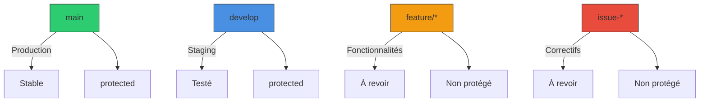
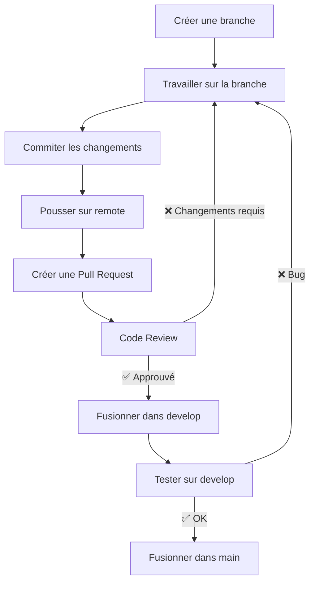

# 🤝 Contribution - AtlanticApp

> *Guide complet pour contribuer au projet : workflow Git, bonnes pratiques, code review, et plus.*

---

## 📖 **Sommaire**

1. [Avant de Commencer](#-avant-de-commencer)
2. [Workflow Git](#-workflow-git)
3. [Créer une Pull Request](#-créer-une-pull-request)
4. [Bonnes Pratiques de Code](#-bonnes-pratiques-de-code)
5. [Code Review](#-code-review)
6. [Règles du Projet](#-règles-du-projet)
7. [Templates](#-templates)
8. [Reconnaissance](#-reconnaissance)

---

**[← Retour à l'accueil](./Home.md) | [Setup ←](./Setup.md) | [FAQ →](./FAQ.md)**

---

## ✨ **Avant de Commencer**

### 🎯 **Comment Contribuer ?**

Il existe plusieurs façons de contribuer au projet AtlanticApp :

| Type de Contribution | Description | Difficulté |
|---------------------|-------------|------------|
| 🐛 **Bug Report** | Signaler un bug | ⭐ |
| 📚 **Documentation** | Améliorer la documentation | ⭐ |
| 🔧 **Correction de Bug** | Corriger un bug existant | ⭐⭐ |
| 🎨 **UI/UX** | Améliorer l'interface utilisateur | ⭐⭐ |
| ✨ **Nouvelle Fonctionnalité** | Ajouter une nouvelle feature | ⭐⭐⭐ |
| 🔥 **Optimisation** | Améliorer les performances | ⭐⭐⭐ |
| 🏗️ **Refactoring** | Nettoyer/améliorer le code existant | ⭐⭐ |

### 📋 **Checklist avant de Contribuer**

- [ ] J'ai lu et compris le **README.md** et ce **Wiki**
- [ ] J'ai configuré mon environnement avec le guide [Setup](./Setup.md)
- [ ] J'ai lancé l'application localement avec succès
- [ ] J'ai vérifié les **issues existantes** pour éviter les doublons
- [ ] J'ai discuté de ma contribution avec l'équipe (si nécessaire)

### 🚀 **Trouver des Tâches**

1. **Consultez les Issues GitHub** :
   - [Issues AtlanticApp](https://github.com/AtlanticApp-dev/Collab-AtlanticApp-mobile/issues)
   - Filtrez par label : `good first issue`, `help wanted`, `bug`, `enhancement`

2. **Labels recommandés pour les débutants** :
   - `🏴️ good first issue` - Parfait pour commencer
   - `🚀 help wanted` - Besoin d'aide de la communauté
   - `🐛 bug` - Correction de bugs
   - `📚 documentation` - Amélioration de la documentation

3. **Contacter l'équipe** :
   - Victor ARIBAUD : victor.aribaud@imt-atlantique.net
   - Ou créer une discussion sur GitHub

---

## 🌐 **Workflow Git**

> *AtlanticApp utilise un workflow Git basé sur les branches de fonctionnalités (Feature Branches).*

### 📊 **Structure des Branches**



| Branche | Description | Protection | Fusion dans |
|---------|-------------|-----------|-------------|
| **main** | Code de production, stable | ✅ Oui | - |
| **develop** | Code de staging, testé | ✅ Oui | main |
| **feature/*** | Nouvelle fonctionnalité | ❌ Non | develop |
| **issue-*** | Correction de bug | ❌ Non | develop |
| **fix/*** | Petites corrections | ❌ Non | develop |
| **docs/*** | Documentation | ❌ Non | develop/main |

### 🎯 **Nommage des Branches**

| Type | Format | Exemple |
|------|--------|---------|
| **Fonctionnalité** | `feature/nom-de-la-fonctionnalite` | `feature/add-favorite-matches` |
| **Correction de bug** | `issue-numero-description` | `issue-19_notification-press-handling` |
| **Correctif** | `fix/description` | `fix/typo-in-calendar` |
| **Documentation** | `docs/section` | `docs/update-readme` |
| **Refactoring** | `refactor/element` | `refactor/events-service` |

**⚠️ Règles de nommage** :
- Utiliser des **noms courts mais descriptifs**
- Utiliser des **tirets** (`-`) pour séparer les mots
- **Ne pas utiliser** de majuscules
- **Ne pas utiliser** d'espaces
- Inclure le **numéro d'issue** si applicable (ex: `issue-19`)

### 🔄 **Workflow Standard**



### 📝 **Étapes Détaillées**

#### 1️⃣ **Créer une Nouvelle Branche**

```bash
# Mettre à jour la branche main
git checkout main
git pull origin main

# Créer une nouvelle branche
git checkout -b feature/ma-nouvelle-fonctionnalite

# Ou pour une issue existante
git checkout -b issue-19_notification-press-handling
```

#### 2️⃣ **Travailler sur la Branche**

- Faites vos modifications
- Testez vos changements localement
- Assurez-vous que tout fonctionne avant de commiter

#### 3️⃣ **Commiter les Changements**

```bash
# Ajouter les fichiers modifiés
git add .

# Commiter avec un message clair
git commit -m "feat: ajouter filtre par école dans le calendrier"
```

**💡 Conseils pour les messages de commit** :
- Utiliser le format **Conventional Commits**
- Préfixer avec :
  - `feat:` pour une nouvelle fonctionnalité
  - `fix:` pour une correction de bug
  - `docs:` pour la documentation
  - `style:` pour des changements de style
  - `refactor:` pour du refactoring
  - `perf:` pour des optimisations de performance
  - `test:` pour des tests
  - `chore:` pour des tâches de maintenance

**Exemples de bons messages** :
```bash
git commit -m "feat: ajouter pagination aux matchs"
git commit -m "fix: corriger affichage des scores null"
git commit -m "docs: mettre à jour le README"
git commit -m "refactor: extraire logique des filtres"
```

**Exemples de mauvais messages** :
```bash
❌ git commit -m "fix"
❌ git commit -m "j'ai changé un truc"
❌ git commit -m "WIP"
❌ git commit -m "correction"
```

#### 4️⃣ **Pousser sur le Repository Distant**

```bash
# Pousser la branche sur remote
git push origin feature/ma-nouvelle-fonctionnalite
```

#### 5️⃣ **Créer une Pull Request**

Voir la section [Créer une Pull Request](#-créer-une-pull-request) ci-dessous.

---

## 📄 **Créer une Pull Request**

### 🎯 **Étapes pour Créer une PR**

1. **Aller sur GitHub** : [AtlanticApp Repository](https://github.com/AtlanticApp-dev/Collab-AtlanticApp-mobile)

2. **Cliquer sur "Pull requests"** → **"New pull request"**

3. **Sélectionner les branches** :
   - **base**: `develop` (ou `main` pour la documentation)
   - **compare**: `votre-branche` (ex: `feature/ma-nouvelle-fonctionnalite`)

4. **Remplir le formulaire de PR**

### 📝 **Template de Pull Request**

> *Copiez-collez ce template dans votre PR pour une meilleure visibilité.*

```markdown
## 🎯 Description

[Expliquez clairement ce que fait cette PR]

- **Type** : [✅] Nouvelle fonctionnalité / [ ] Correction de bug / [ ] Documentation / [ ] Refactoring / [ ] Autres
- **Issue liée** : #123 (si applicable)

## 📋 Changements

- [ ] Ajout de la fonctionnalité X
- [ ] Correction du bug Y
- [ ] Mise à jour de la documentation
- [ ] Tests ajoutés/mis à jour

## 📸 Captures d'Écran (si applicable)

[Ajoutez des captures d'écran pour montrer les changements visuels]

## ✅ Checklist

- [ ] Mon code suit les [règles du projet](#-règles-du-projet)
- [ ] J'ai testé mes changements localement
- [ ] J'ai ajouté des tests si nécessaire
- [ ] J'ai mis à jour la documentation si nécessaire
- [ ] Ma PR cible la bonne branche (`develop` pour les features, `main` pour la prod)
- [ ] Je n'ai pas de conflits avec la branche cible

## 💡 Notes supplémentaires

[Ajoutez toutes informations supplémentaires pour les reviewers]
```

### 🏷️ **Labels à Utiliser**

| Label | Quand l'utiliser |
|-------|------------------|
| `🏴️ good first issue` | Issue adaptée aux débutants |
| `🚀 help wanted` | Besoin d'aide de la communauté |
| `🐛 bug` | Correction de bug |
| `✨ enhancement` | Nouvelle fonctionnalité |
| `📚 documentation` | Mise à jour de la documentation |
| `🔥 high priority` | Priorité élevée |
| `🎨 UI/UX` | Changements d'interface |
| `🔧 backend` | Changements backend/Firebase |

### 👥 **Assigner des Reviewers**

- **Victor ARIBAUD** (@victor-aribaud) - Reviewer principal
- **Autres contributeurs** - Selon la spécialité

---

## ✅ **Bonnes Pratiques de Code**

### 🎯 **Qualité du Code**

#### 1️⃣ **Lisibilité**

```typescript
// ✅ Bien
const getUserFromId = async (userId: string): Promise<User | null> => {
  try {
    const docSnap = await getDoc(doc(db, 'users', userId));
    if (docSnap.exists) {
      return { id: docSnap.id, ...docSnap.data() } as User;
    }
    return null;
  } catch (error) {
    console.error('Error fetching user:', error);
    return null;
  }
};

// ❌ À éviter
function getUserFromId(userId) {
  return getDoc(doc(db, 'users', userId)).then(docSnap => {
    if (docSnap.exists) return { ...docSnap.data(), id: docSnap.id };
    return null;
  });
}
```

#### 2️⃣ **Typage TypeScript**

```typescript
// ✅ Bien - Toujours typer les paramètres et retours
const getMatchFromId = async (matchId: string): Promise<Match> => {
  const docSnap = await getDoc(doc(db, 'matches', matchId));
  if (!docSnap.exists) {
    throw new Error(`Match ${matchId} not found`);
  }
  return { id: docSnap.id, ...docSnap.data() } as Match;
};

// ❌ À éviter - Pas de typage
function getMatchFromId(matchId) {
  return getDoc(doc(db, 'matches', matchId));
}
```

#### 3️⃣ **Gestion des Erreurs**

```typescript
// ✅ Bien - Toujours gérer les erreurs
try {
  const user = await getUserFromUid(uid);
  setUser(user);
} catch (error) {
  console.error('Error fetching user:', error);
  setError('Impossible de charger l\'utilisateur');
  // Optionnel : loguer l'erreur vers un service de monitoring
}

// ❌ À éviter - Pas de gestion d'erreur
const user = await getUserFromUid(uid);
setUser(user);
```

#### 4️⃣ **Nommage**

| Type | Convention | Exemple |
|------|-----------|---------|
| **Variables** | camelCase | `userData`, `matchList` |
| **Fonctions** | camelCase | `getUserFromId`, `updateMatchScore` |
| **Composants** | PascalCase | `MatchCard`, `EventList` |
| **Constantes** | UPPER_SNAKE_CASE | `PAGE_SIZE`, `API_URL` |
| **Types/Interfaces** | PascalCase | `User`, `MatchInterface` |
| **Fichiers** | kebab-case | `events-service.ts`, `match-card.tsx` |

#### 5️⃣ **Commentaires**

```typescript
// ✅ Bien - Commentaires utiles
/**
 * Récupère les matchs d'un sport spécifique
 * @param sportId - ID du sport
 * @param limit - Nombre maximum de matchs à retourner
 * @returns Promise<Match[]> - Liste des matchs
 */
const getMatchesFromSportId = async (sportId: string, limit: number = 10): Promise<Match[]> => {
  // ...
};

// ❌ À éviter - Commentaires inutiles
// Cette fonction récupère les matchs
function getMatches() {
  // ...
}

// ❌ À éviter - Commentaires obsolètes
// TODO: Mettre à jour cette fonction
// (le TODO est toujours là mais personne ne le fait)
```

### 🎯 **Structure du Code**

#### 1️⃣ **Principe de Responsabilité Unique**

```typescript
// ✅ Bien - Une fonction = une responsabilité
const fetchMatches = async (params: FetchParams) => {
  // Ne fait que récupérer les matchs
};

const formatMatches = (matches: Match[]) => {
  // Ne fait que formater les matchs
};

// ❌ À éviter - Une fonction fait trop de choses
const processMatches = async (params: FetchParams) => {
  // Récupère les matchs
  const matches = await fetchMatches(params);
  // Formate les matchs
  const formatted = formatMatches(matches);
  // Sauvegarde en cache
  await cache.set('matches', formatted);
  // Retourne
  return formatted;
};
```

#### 2️⃣ **Éviter la Duplication**

```typescript
// ✅ Bien - Code réutilisable
const formatDate = (date: Date | FirebaseFirestoreTypes.Timestamp): string => {
  const d = date instanceof Date ? date : (date as any).toDate();
  return d.toLocaleString('fr-FR');
};

// ❌ À éviter - Code dupliqué
// Dans file1.ts
const formattedDate1 = match.start_time.toLocaleString('fr-FR');

// Dans file2.ts
const formattedDate2 = event.start_time.toLocaleString('fr-FR');

// Dans file3.ts
const formattedDate3 = notification.createdAt.toLocaleString('fr-FR');
```

#### 3️⃣ **Taille des Fichiers**

- **Maximum recommandé** : 300-500 lignes par fichier
- **Si le fichier dépasse 500 lignes** : Envisager de le diviser
- **Si le fichier dépasse 1000 lignes** : **Obligation** de diviser

**Exemple de division** :
```
components/
├── MatchCard.tsx          # 200 lignes
├── MatchCardHeader.tsx    # 100 lignes
├── MatchCardBody.tsx      # 100 lignes
└── MatchCardFooter.tsx    # 100 lignes
```

---

## 👀 **Code Review**

### 🎯 **Critères de Validation**

#### ✅ **À Vérifier lors d'une Review**

| Critère | Description | Important |
|---------|-------------|-----------|
| **Fonctionnalité** | Le code fait-il ce qu'il est censé faire ? | ⭐⭐⭐⭐⭐ |
| **Qualité du code** | Le code est-il propre, lisible, bien structuré ? | ⭐⭐⭐⭐ |
| **Typage** | Tous les types TypeScript sont-ils présents ? | ⭐⭐⭐⭐ |
| **Gestion des erreurs** | Les erreurs sont-elles gérées correctement ? | ⭐⭐⭐⭐ |
| **Performance** | Y a-t-il des problèmes de performance évidents ? | ⭐⭐⭐ |
| **Sécurité** | Y a-t-il des problèmes de sécurité ? | ⭐⭐⭐⭐⭐ |
| **Tests** | Les tests sont-ils présents et pertinents ? | ⭐⭐⭐ |
| **Documentation** | La documentation est-elle mise à jour ? | ⭐⭐ |

#### 🔍 **Checklist pour le Reviewer**

- [ ] Le message de commit suit le format Conventional Commits
- [ ] La PR a une description claire
- [ ] Les changements sont testables
- [ ] Les tests passent (si applicable)
- [ ] Le code suit les [règles du projet](#-règles-du-projet)
- [ ] Aucune clé API ou secret n'est commité
- [ ] Les conflits de fusion sont résolus
- [ ] La PR cible la bonne branche

### 💬 **Comment Faire une Bonne Review**

#### ✅ **Bons Commentaires de Review**

```markdown
👍 Bien joué pour la gestion des erreurs !

💡 Suggestion : On pourrait extraire la logique de filtrage dans une fonction séparée pour améliorer la lisibilité.

❓ Question : Pourquoi utiliser `any` ici au lieu d'un type spécifique ?

⚠️ Problème : Cette requête Firestore pourrait être optimisée. On devrait ajouter un index composite.
```

#### ❌ **Mauvais Commentaires de Review**

```markdown
❌ "J'aime pas"
❌ "C'est nul"
❌ "Fais autre chose"
❌ "LOL"
```

### 🛡️ **Gérer les Conflits**

Si votre PR a des conflits :

1. **Mettre à jour votre branche locale** :
   ```bash
   git checkout develop
   git pull origin develop
   git checkout ma-branche
   ```

2. **Fusionner develop dans votre branche** :
   ```bash
   git merge develop
   ```

3. **Résoudre les conflits** manuellement dans votre éditeur

4. **Commiter la résolution** :
   ```bash
   git add .
   git commit -m "fix: résoudre les conflits de fusion"
   ```

5. **Pousser** :
   ```bash
   git push origin ma-branche
   ```

---

## 📜 **Règles du Projet**

### 🎯 **Règles Générales**

1. **Respectez le code existant** : Suivez le style et les conventions déjà en place
2. **Commitez souvent** : Faites des petits commits atomiques
3. **Écrivez de bons messages de commit** : Utilisez Conventional Commits
4. **Testez vos changements** : Assurez-vous que tout fonctionne avant de pousser
5. **Documentez** : Mettez à jour la documentation si nécessaire
6. **Ne commitez pas** :
   - de secrets (clés API, tokens, etc.)
   - de code mort (code inutilisé)
   - de logs de débogage (`console.log`)
   - de fichiers générés (`node_modules/`, `.DS_Store`, etc.)

### 🎯 **Règles de Style**

#### **Indentation et Formatage**

- **Indentation** : 2 espaces (pas de tabulations)
- **Longueur des lignes** : Maximum 120 caractères
- **Vergules** : Toujours une virgule à la fin des objets/liste multligne
- **Points-virgules** : Toujours présents (sauf pour les interfaces TypeScript)

```typescript
// ✅ Bien
const user = {
  id: '123',
  name: 'John',
  email: 'john@example.com',
};

// ❌ À éviter
const user = {
  id: '123',
  name: 'John',
  email: 'john@example.com'
}
```

#### **Imports**

- **Ordre des imports** :
  1. Imports React
  2. Imports externes (librairies)
  3. Imports locaux (projet)
  4. Styles
- **Grouper les imports** : Un import par ligne
- **Alias** : Utiliser `@/` pour le chemin racine

```typescript
// ✅ Bien
import React, { useState, useEffect } from 'react';
import { View, Text, StyleSheet } from 'react-native';
import { Ionicons } from '@expo/vector-icons';
import { getMatches } from '@/src/api/services/firestore/matchService';
import { Match } from '@/types/models';
import styles from './styles';

// ❌ À éviter
import { View, Text, StyleSheet } from 'react-native', { useState, useEffect } from 'react';
import { Ionicons } from '@expo/vector-icons', { getMatches } from '../../../api/services/firestore/matchService';
```

### 🎯 **Règles de Sécurité**

1. **Ne jamais commiter** :
   - Clés API Firebase
   - Tokens FCM
   - Secrets de base de données
   - Informations personnelles

2. **Utiliser les variables d'environnement** pour tout ce qui est sensible :
   ```typescript
   // ✅ Bien
   const apiKey = process.env.REACT_APP_FIREBASE_API_KEY;
   
   // ❌ À éviter
   const apiKey = 'AIzaSy...';
   ```

3. **Ne pas logger d'informations sensibles** :
   ```typescript
   // ✅ Bien
   console.log('User logged in:', user.id);
   
   // ❌ À éviter
   console.log('User logged in:', user.email, user.password);
   ```

---

## 📝 **Templates**

### 🎯 **Template de Pull Request**

```markdown
## 🎯 Description

[Expliquez clairement ce que fait cette PR]

- **Type** : [✅] Nouvelle fonctionnalité / [ ] Correction de bug / [ ] Documentation / [ ] Refactoring / [ ] Autres
- **Issue liée** : #123 (si applicable)

## 📋 Changements

- [ ] Ajout de la fonctionnalité X
- [ ] Correction du bug Y
- [ ] Mise à jour de la documentation
- [ ] Tests ajoutés/mis à jour

## 📸 Captures d'Écran

[Ajoutez des captures d'écran si les changements sont visibles]

## ✅ Checklist

- [ ] Mon code suit les règles du projet
- [ ] J'ai testé mes changements localement
- [ ] J'ai ajouté des tests si nécessaire
- [ ] J'ai mis à jour la documentation si nécessaire
- [ ] Ma PR cible la bonne branche
- [ ] Je n'ai pas de conflits avec la branche cible

## 💡 Notes supplémentaires

[Ajoutez toutes informations supplémentaires pour les reviewers]
```

### 🎯 **Template de Commit**

```bash
# Pour une nouvelle fonctionnalité
git commit -m "feat: ajouter pagination aux matchs"

# Pour une correction de bug
git commit -m "fix: corriger affichage des scores null"

# Pour du refactoring
git commit -m "refactor: extraire logique des filtres dans un service"

# Pour de la documentation
git commit -m "docs: mettre à jour le README"

# Pour des tests
git commit -m "test: ajouter des tests pour eventsService"

# Pour des corrections de style
git commit -m "style: corriger l'indentation"

# Pour de la maintenance
git commit -m "chore: mettre à jour les dépendances"
```

### 🎯 **Template d'Issue**

```markdown
## 🐛 Description du Bug / ✨ Idée de Fonctionnalité

[Décrivez clairement le problème ou l'idée]

## 📋 Étapes pour Reproduire (Bug uniquement)

1. Aller sur l'écran X
2. Appuyer sur le bouton Y
3. Scroll vers le bas
4. Le bug se produit

## 🎯 Comportement Attendu

[Ce qui devrait se passer]

## 📸 Captures d'Écran / Vidéos

[Ajoutez des captures d'écran ou vidéos si possible]

## 💡 Informations Supplémentaires

- **Environnement** : Android / iOS / Web
- **Version de l'app** : 1.0.0
- **Device** : Pixel 6 / iPhone 13
- **OS** : Android 13 / iOS 16

## ⚠️ Priorité

- [ ] 🔥 Urgent (blocage critique)
- [ ] ⚠️ Haute (problème important)
- [ ] 🟡 Moyenne (amélioration utile)
- [ ] 🟢 Basse (amélioration mineure)
```

---

## 🎁 **Reconnaissance**

### 🌟 **Comment Être Reconnu ?**

1. **Ajouté aux contributeurs** : Votre nom apparaîtra dans la section des contributeurs
2. **Mention dans le changelog** : Vos contributions seront mentionnées
3. **Invitation à la team** : Les contributeurs actifs peuvent être invités à rejoindre l'équipe core
4. **Swag AtlanticApp** : Des goodies peuvent être envoyés aux contributeurs majeurs

### 🏆 **Niveaux de Contribution**

| Niveau | Description | Reconnaissable |
|--------|-------------|----------------|
| **🥉 Contributeur** | 1-5 PRs merge | ✅ Ajouté aux contributeurs |
| **🥈 Contributeur Actif** | 6-20 PRs merge | ✅ + Mention spéciale |
| **🥇 Contributeur Principal** | 20+ PRs merge | ✅ + Accès avancé + Swag |
| **👑 Mainteneur** | Contributions régulières + review | ✅ + Accès admin |

### 📊 **Tableau des Contributeurs**

> *Ce tableau sera mis à jour régulièrement.*

| Contributeur | PRs | Issues | Compétences |
|--------------|-----|--------|-------------|
| Victor ARIBAUD | 50+ | 20+ | Full Stack |
| [Votre Nom] | [X] | [Y] | [Vos compétences] |

---

## 🔄 **Navigation**

```
┌─────────────────────────────────────────────────────────────┐
│                      CONTRIBUTION                             │
├─────────────────────────────────────────────────────────────┤
│  [Avant de commencer]  │  [Workflow Git]  │  [PR]  │  [Code]      │
├─────────────────────────────────────────────────────────────┤
│  [Review]  │  [Règles]  │  [Templates]  │  [Reconnaissance]     │
└─────────────────────────────────────────────────────────────┘
```

**[← Retour à l'accueil](./Home.md) | [Setup ←](./Setup.md) | [FAQ →](./FAQ.md)**

---

*Dernière mise à jour : 13 juin 2026*
*Merci à tous les contributeurs ! 🎉*
