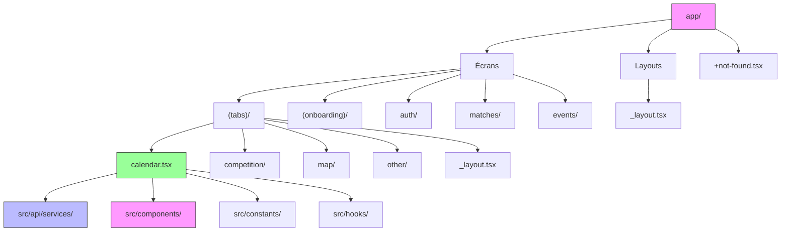

# 📱 Frontend : React Native - AtlanticApp

> *Guide complet du frontend : Expo, React Native, composants, navigation et bonnes pratiques.*

---

## 📖 **Sommaire**

1. [Architecture Frontend](#-architecture-frontend)
2. [Expo vs React Native CLI](#-expo-vs-react-native-cli)
3. [Navigation avec Expo Router](#-navigation-avec-expo-router)
4. [Librairies Clés](#-librairies-clés)
5. [Composants Principaux](#-composants-principaux)
6. [Gestion d'État](#-gestion-détat)
7. [Exemples de Code Complets](#-exemples-de-code-complets)
8. [Bonnes Pratiques Frontend](#-bonnes-pratiques-frontend)

---

**[← Retour à l'accueil](./Home.md) | [Backend Firebase ←](./Backend-Firebase.md) | [Setup →](./Setup.md)**

---

## 🏗️ **Architecture Frontend**



---

## 🤔 **Expo vs React Native CLI**

### 📊 **Comparaison**

| Critère | Expo | React Native CLI |
|---------|------|------------------|
| **Facilité d'utilisation** | ⭐⭐⭐⭐⭐ Très simple | ⭐⭐⭐ Complexe |
| **Configuration** | Zéro configuration | Configuration manuelle |
| **Dépendances** | Gérées par Expo | À gérer manuellement |
| **Accès aux APIs natives** | Limité (sauf avec config plugins) | Accès complet |
| **Build** | `expo build:android` / `expo build:ios` | `react-native run-android` |
| **Hot Reload** | ✅ Oui | ✅ Oui |
| **OTA Updates** | ✅ Oui (Expo Updates) | ❌ Non |
| **Compatibilité** | Android, iOS, Web | Android, iOS |

**AtlanticApp utilise Expo** car :
- ⚡ **Développement plus rapide** - Pas besoin de configurer Xcode/Android Studio pour commencer
- 📦 **Gestion simplifiée des dépendances** - Expo gère tout pour nous
- 🎨 **Ecosystème riche** - Accès à de nombreuses APIs via des packages Expo
- 🌐 **Multiplateforme** - Une seule codebase pour Android, iOS et même Web

---

## 🧭 **Navigation avec Expo Router**

> *Expo Router est un système de navigation **basé sur le système de fichiers**, inspiré de Next.js.*

### 📁 **Structure des Fichiers = Routes**

```
app/
├── _layout.tsx              → /          (Root layout)
├── (tabs)/                  → /(tabs)    (Groupe de routes)
│   ├── _layout.tsx          → /(tabs)    (Tab layout)
│   ├── calendar.tsx         → /(tabs)/calendar
│   ├── competition/         → /(tabs)/competition
│   │   ├── _layout.tsx      → /(tabs)/competition (Nested layout)
│   │   ├── index.tsx        → /(tabs)/competition
│   │   └── [sport_id].tsx    → /(tabs)/competition/[sport_id]
│   └── map/
│       ├── index.tsx        → /(tabs)/map
│       └── placeDetail.tsx   → /(tabs)/map/placeDetail
├── (onboarding)/             → /(onboarding)
│   ├── _layout.tsx          → /(onboarding)
│   ├── index.tsx            → /(onboarding)
│   └── allowNotifications.tsx → /(onboarding)/allowNotifications
└── +not-found.tsx           → 404 page
```

### 🎯 **Fichiers Clés de Navigation**

#### 1️⃣ **`app/_layout.tsx` - Layout Principal**

```typescript
// app/_layout.tsx
import { Stack } from 'expo-router';
import { SafeAreaProvider } from 'react-native-safe-area-context';

export default function RootLayout() {
  return (
    <SafeAreaProvider>
      <Stack>
        <Stack.Screen 
          name="(tabs)" 
          options={{ headerShown: false }} 
        />
        <Stack.Screen 
          name="(onboarding)" 
          options={{ headerShown: false }} 
        />
        <Stack.Screen 
          name="auth" 
          options={{ headerShown: false }} 
        />
        <Stack.Screen 
          name="matches" 
          options={{ headerShown: false }} 
        />
        <Stack.Screen 
          name="events" 
          options={{ headerShown: false }} 
        />
      </Stack>
    </SafeAreaProvider>
  );
}
```

#### 2️⃣ **`app/(tabs)/_layout.tsx` - Layout des Onglets**

```typescript
// app/(tabs)/_layout.tsx
import { Tabs } from 'expo-router';
import { Ionicons } from '@expo/vector-icons';

export default function TabLayout() {
  return (
    <Tabs
      screenOptions={{
        tabBarActiveTintColor: '#1d4966',
        tabBarInactiveTintColor: '#999',
        tabBarStyle: {
          backgroundColor: '#fff',
          borderTopWidth: 0,
          height: 70,
          paddingBottom: 10,
        },
        tabBarLabelStyle: {
          fontSize: 12,
          marginBottom: 5,
        },
      }}
    >
      <Tabs.Screen
        name="calendar"
        options={{
          title: 'Calendrier',
          tabBarIcon: ({ color, size }) => (
            <Ionicons name="calendar-outline" size={size} color={color} />
          ),
        }}
      />
      <Tabs.Screen
        name="competition"
        options={{
          title: 'Compétition',
          tabBarIcon: ({ color, size }) => (
            <Ionicons name="trophy-outline" size={size} color={color} />
          ),
        }}
      />
      <Tabs.Screen
        name="map"
        options={{
          title: 'Carte',
          tabBarIcon: ({ color, size }) => (
            <Ionicons name="map-outline" size={size} color={color} />
          ),
        }}
      />
      <Tabs.Screen
        name="other"
        options={{
          title: 'Menu',
          tabBarIcon: ({ color, size }) => (
            <Ionicons name="menu-outline" size={size} color={color} />
          ),
        }}
      />
    </Tabs>
  );
}
```

#### 3️⃣ **Navigation Programmatique**

```typescript
import { router } from 'expo-router';

// Naviguer vers un écran
router.navigate('/(tabs)/calendar');
router.navigate('/matches/head_to_head/abc123');

// Naviguer avec paramètres
router.navigate({
  pathname: '/matches/head_to_head/[id]',
  params: { id: 'match_123' }
});

// Revenir en arrière
router.back();

// Aller à la racine
router.replace('/');

// Pousser une nouvelle route dans la pile
router.push('/auth/connexion');
```

#### 4️⃣ **Passage de Paramètres**

**Route dynamique** : `app/matches/head_to_head/[id].tsx`

```typescript
// app/matches/head_to_head/[id].tsx
import { useLocalSearchParams } from 'expo-router';

export default function HeadToHeadMatchScreen() {
  const { id } = useLocalSearchParams<{ id: string }>();
  
  // Utilisation de l'ID
  const [match, setMatch] = useState<Match | null>(null);
  
  useEffect(() => {
    const fetchMatch = async () => {
      const matchData = await getMatchFromId(id);
      setMatch(matchData);
    };
    fetchMatch();
  }, [id]);
  
  return <MatchCard match={match} />;
}
```

---

## 📦 **Librairies Clés**

### 🎯 **UI et Composants**

| Librairie | Version | Utilisation | Exemple |
|-----------|---------|-------------|---------|
| **React Native Paper** | ^5.12.5 | Composants Material Design | `Button`, `Card`, `TextInput` |
| **React Native SVG** | 15.15.3 | SVG et icônes | `Svg`, `Path`, `Circle` |
| **React Native Maps** | 1.27.2 | Cartes interactives | `MapView`, `Marker` |
| **React Native Pager View** | 8.0.0 | Vue paginée (pour onboarding) | `PagerView` |
| **React Native Gesture Handler** | ~2.30.0 | Gestion des gestes | `TouchableOpacity`, `PanGestureHandler` |
| **React Native Reanimated** | 4.2.1 | Animations fluides | `Animated`, `useAnimatedStyle` |
| **React Native Safe Area Context** | ~5.6.2 | Gestion des safe areas | `SafeAreaView`, `useSafeAreaInsets` |
| **Expo Vector Icons** | ^15.0.2 | Icônes | `Ionicons`, `MaterialIcons` |
| **Expo Image** | ~55.0.14 | Gestion des images | `Image` |
| **React Native Paper** | ^5.12.5 | Dialogues, menus | `Dialog`, `Menu`, `Portal` |

**Exemple avec React Native Paper** :

```typescript
import { Button, Card, Text, Dialog, Portal } from 'react-native-paper';

const MyComponent = () => {
  const [visible, setVisible] = useState(false);
  
  return (
    <>
      <Card style={{ margin: 16 }}>
        <Card.Content>
          <Text variant="titleLarge">Titre</Text>
          <Text variant="bodyMedium">Description</Text>
        </Card.Content>
        <Card.Actions>
          <Button onPress={() => setVisible(true)}>Ouvrir Dialogue</Button>
        </Card.Actions>
      </Card>
      
      <Portal>
        <Dialog visible={visible} onDismiss={() => setVisible(false)}>
          <Dialog.Title>Titre du dialogue</Dialog.Title>
          <Dialog.Content>
            <Text>Contenu du dialogue</Text>
          </Dialog.Content>
          <Dialog.Actions>
            <Button onPress={() => setVisible(false)}>Fermer</Button>
          </Dialog.Actions>
        </Dialog>
      </Portal>
    </>
  );
};
```

### 🎯 **Navigation**

| Librairie | Version | Utilisation |
|-----------|---------|-------------|
| **Expo Router** | ~55.0.12 | Navigation basée sur fichiers | `router.navigate()` |
| **React Navigation** | ^7.x | Navigation alternative | `createStackNavigator()` |

### 🎯 **Gestion d'État et Stockage**

| Librairie | Version | Utilisation | Exemple |
|-----------|---------|-------------|---------|
| **AsyncStorage** | 2.2.0 | Stockage local | `setItem()`, `getItem()` |
| **React Context API** | Built-in | État global | `createContext()`, `useContext()` |

**Exemple avec AsyncStorage** :

```typescript
import AsyncStorage from '@react-native-async-storage/async-storage';

// Sauvegarder
const saveFavoriteDelegation = async (delegationId: string) => {
  await AsyncStorage.setItem('supported_delegation', delegationId);
};

// Récupérer
const getFavoriteDelegation = async () => {
  return await AsyncStorage.getItem('supported_delegation');
};

// Supprimer
const removeFavoriteDelegation = async () => {
  await AsyncStorage.removeItem('supported_delegation');
};
```

### 🎯 **Firebase**

| Librairie | Version | Utilisation |
|-----------|---------|-------------|
| **@react-native-firebase/app** | ^24.0.0 | Initialisation Firebase | `getApps()` |
| **@react-native-firebase/firestore** | ^24.0.0 | Firestore | `getFirestore()`, `collection()` |
| **@react-native-firebase/auth** | ^24.0.0 | Authentification | `signInWithEmailAndPassword()` |
| **@react-native-firebase/messaging** | ^24.0.0 | FCM | `getToken()`, `subscribeToTopic()` |

---

## 🧩 **Composants Principaux**

### 🎯 **Composants d'Écran**

#### 📅 **calendar.tsx - Calendrier des Matchs**

> *Écran principal affichant la liste paginée des matchs avec filtres.*

**Fonctionnalités** :
- ✅ Affichage paginé avec `FlatList`
- ✅ Filtre par école (`seeSchoolOnly`)
- ✅ Blacklist des statuts (`blackList`)
- ✅ Animation du header
- ✅ Pull-to-refresh
- ✅ Chargement infini

**Structure du composant** :

```typescript
// app/(tabs)/calendar.tsx
const CalendarTab: React.FC = () => {
  // 1. États
  const [events, setEvents] = useState<any[]>([]);
  const [loading, setLoading] = useState(false);
  const [seeSchoolOnly, setSeeSchoolOnly] = useState(false);
  const [selectedTeam, setSelectedTeam] = useState<string | null>(null);
  const [lastDoc, setLastDoc] = useState<QueryDocumentSnapshot | null>(null);
  const [hasMore, setHasMore] = useState(true);
  const [refreshing, setRefreshing] = useState(false);
  
  // 2. Filtres
  const blackList: string[] = ['completed', 'cancelled'];
  
  // 3. Chargement des événements
  const loadMoreEvents = async () => {
    if (loading || !hasMore) return;
    setLoading(true);
    
    try {
      const { docs, lastDoc: newLastDoc } = await fetchNextPage({
        lastDoc,
        selectedSchool: seeSchoolOnly ? selectedTeam : null,
        blackList,
        placeId: null
      });
      
      setEvents(prev => [...prev, ...docs]);
      setLastDoc(newLastDoc);
      if (docs.length < ITEMS_PER_PAGE) setHasMore(false);
    } catch (err) {
      console.error('Erreur chargement:', err);
    }
    setLoading(false);
  };
  
  // 4. Rafraîchissement
  const refreshEvents = async () => {
    setRefreshing(true);
    setEvents([]);
    setLastDoc(null);
    setHasMore(true);
    
    try {
      const { docs, lastDoc: newLastDoc } = await fetchNextPage({
        lastDoc: null,
        selectedSchool: seeSchoolOnly ? selectedTeam : null,
        blackList,
        placeId: null
      });
      
      setEvents(docs);
      setLastDoc(newLastDoc);
      if (docs.length < ITEMS_PER_PAGE) setHasMore(false);
    } catch (err) {
      console.error('Erreur refresh:', err);
    } finally {
      setRefreshing(false);
    }
  };
  
  // 5. Effets
  useEffect(() => {
    loadMoreEvents();
  }, []);
  
  useEffect(() => {
    getTeamFromStorage().then(refreshEvents);
  }, [seeSchoolOnly]);
  
  // 6. Rendu
  return (
    <SafeAreaView style={styles.container}>
      {/* Header animé */}
      <Animated.View style={{ height: headerHeight }}>
        <Image source={require('@/assets/images/logo.png')} />
      </Animated.View>
      
      {/* Liste des événements */}
      <Animated.View style={{ height: listHeight }}>
        <FlatList
          data={events}
          renderItem={({ item }) => <EventCard event={item} />}
          keyExtractor={(item) => item.id}
          ListHeaderComponent={/* Bouton de filtre */}
          ListFooterComponent={/* Loader */}
          refreshControl={<RefreshControl refreshing={refreshing} onRefresh={refreshEvents} />}
          onEndReached={loadMoreEvents}
          onEndReachedThreshold={0.5}
        />
      </Animated.View>
    </SafeAreaView>
  );
};
```

#### 🏆 **Compétition - sportDetail/[sport_id].tsx**

> *Écran affichant les détails d'un sport avec ses matchs.*

**Fonctionnalités** :
- Onglets pour différentes vues (Matchs, Classement, Résultats)
- Filtres par catégorie
- Navigation entre matchs

**Structure** :

```typescript
// app/(tabs)/competition/sportDetail/[sport_id].tsx
import { useLocalSearchParams } from 'expo-router';
import { createMaterialTopTabNavigator } from '@react-navigation/material-top-tabs';

const Tab = createMaterialTopTabNavigator();

export default function SportDetailScreen() {
  const { sport_id } = useLocalSearchParams<{ sport_id: string }>();
  
  return (
    <Tab.Navigator>
      <Tab.Screen 
        name="Matches" 
        children={() => <SportMatchesTab sportId={sport_id} />}
      />
      <Tab.Screen 
        name="Ranking" 
        children={() => <SportRankingTab sportId={sport_id} />}
      />
      <Tab.Screen 
        name="Results" 
        children={() => <SportResultsTab sportId={sport_id} />}
      />
    </Tab.Navigator>
  );
}
```

#### 🗺️ **Map - index.tsx**

> *Carte interactive affichant les lieux de compétition.*

**Fonctionnalités** :
- Carte avec marqueurs
- Zoom et défilement
- Navigation vers les détails d'un lieu

**Structure** :

```typescript
// app/(tabs)/map/index.tsx
import MapView, { Marker } from 'react-native-maps';
import { useEffect, useState } from 'react';
import { getAllPlaces } from '@/src/api/services/firestore/placeService';

export default function MapScreen() {
  const [places, setPlaces] = useState<Place[]>([]);
  const [region, setRegion] = useState({
    latitude: 47.2184,
    longitude: -1.5536,
    latitudeDelta: 0.0922,
    longitudeDelta: 0.0421,
  });
  
  useEffect(() => {
    const fetchPlaces = async () => {
      const placesData = await getAllPlaces();
      setPlaces(placesData);
    };
    fetchPlaces();
  }, []);
  
  return (
    <MapView style={styles.map} region={region}>
      {places.map((place) => (
        <Marker
          key={place.id}
          coordinate={place.location}
          title={place.name}
          description={place.description}
          onPress={() => router.navigate(`/map/placeDetail?id=${place.id}`)}
        >
          <CustomMarker icon={place.icon} />
        </Marker>
      ))}
    </MapView>
  );
}
```

### 🎯 **Composants Réutilisables**

#### ⚽ **MatchCard.tsx**

> *Carte affichant les informations d'un match.*

```typescript
// src/components/Match/MatchCard.tsx
import { View, Text, StyleSheet, TouchableOpacity } from 'react-native';
import { Ionicons } from '@expo/vector-icons';
import { useRouter } from 'expo-router';

interface MatchCardProps {
  match: Match;
  showDetails?: boolean;
}

export const MatchCard = ({ match, showDetails = true }: MatchCardProps) => {
  const router = useRouter();
  
  const formatTime = (date: Date) => {
    return date.toLocaleTimeString('fr-FR', { 
      hour: '2-digit', 
      minute: '2-digit' 
    });
  };
  
  const formatDate = (date: Date) => {
    return date.toLocaleDateString('fr-FR', { 
      day: 'numeric', 
      month: 'short',
      year: 'numeric'
    });
  };
  
  return (
    <TouchableOpacity
      style={styles.card}
      onPress={() => showDetails && router.navigate(`/matches/head_to_head/${match.id}`)}
    >
      <View style={styles.header}>
        <Text style={styles.sport}>{match.title}</Text>
        <Text style={styles.date}>{formatDate(match.start_time)}</Text>
      </View>
      
      <View style={styles.timeContainer}>
        <Ionicons name="time-outline" size={16} color="#666" />
        <Text style={styles.time}>{formatTime(match.start_time)}</Text>
      </View>
      
      <View style={styles.teams}>
        <TeamInfo team={match.teams[0]} />
        <Text style={styles.vs}>VS</Text>
        <TeamInfo team={match.teams[1]} />
      </View>
      
      {match.team1_score !== null && match.team2_score !== null && (
        <View style={styles.score}>
          <Text style={styles.scoreText}>{match.team1_score} - {match.team2_score}</Text>
        </View>
      )}
      
      <StatusBadge status={match.status} />
    </TouchableOpacity>
  );
};

const TeamInfo = ({ team }: { team: Team }) => (
  <View style={styles.team}>
    <Text style={[styles.teamName, { color: team.color }]}>
      {team.name}
    </Text>
    {team.score !== null && (
      <Text style={styles.teamScore}>{team.score}</Text>
    )}
  </View>
);

const StatusBadge = ({ status }: { status: string }) => {
  const getStatusColor = () => {
    switch (status) {
      case 'scheduled': return '#4a90e2';
      case 'ongoing': return '#2ecc71';
      case 'completed': return '#95a5a6';
      case 'cancelled': return '#e74c3c';
      default: return '#7f8c8d';
    }
  };
  
  return (
    <View style={[styles.badge, { backgroundColor: getStatusColor() }]}>
      <Text style={styles.badgeText}>{status.toUpperCase()}</Text>
    </View>
  );
};
```

#### 📊 **AtlanticupRanking.tsx**

> *Composant affichant un classement.*

```typescript
// src/components/Ranking/AtlanticupRanking.tsx
import { View, Text, StyleSheet, FlatList } from 'react-native';

interface RankingProps {
  type: 'general' | 'sport' | 'category';
  data: Team[] | Delegation[];
  showMedals?: boolean;
}

export const AtlanticupRanking = ({ 
  type, 
  data, 
  showMedals = true 
}: RankingProps) => {
  const renderItem = ({ item, index }: { item: Team | Delegation; index: number }) => (
    <View style={styles.row}>
      {showMedals && index < 3 && (
        <Medal position={index + 1} />
      )}
      <Text style={styles.rank}>{index + 1}</Text>
      <Text style={styles.name}>{'name' in item ? item.name : (item as Delegation).name}</Text>
      <Text style={styles.points}>{'points' in item ? item.points : (item as Delegation).points}</Text>
    </View>
  );
  
  return (
    <View style={styles.container}>
      <Text style={styles.title}>
        Classement {type === 'general' ? 'Général' : 
                  type === 'sport' ? 'par Sport' : 'par Catégorie'}
      </Text>
      
      <FlatList
        data={data}
        renderItem={renderItem}
        keyExtractor={(item, index) => index.toString()}
        ListHeaderComponent={(
          <View style={styles.header}>
            <Text style={[styles.headerText, { width: 40 }]}>#</Text>
            <Text style={[styles.headerText, { flex: 1 }]}>Nom</Text>
            <Text style={[styles.headerText, { width: 60 }]}>Points</Text>
          </View>
        )}
      />
    </View>
  );
};

const Medal = ({ position }: { position: number }) => {
  const getMedalColor = () => {
    switch (position) {
      case 1: return '#FFD700'; // Or
      case 2: return '#C0C0C0'; // Argent
      case 3: return '#CD7F32'; // Bronze
      default: return '#95a5a6';
    }
  };
  
  const getMedalIcon = () => {
    switch (position) {
      case 1: return '🥇';
      case 2: return '🥈';
      case 3: return '🥉';
      default: return '⭐';
    }
  };
  
  return (
    <Text style={[styles.medal, { color: getMedalColor() }]}>
      {getMedalIcon()}
    </Text>
  );
};
```

#### 🗺️ **AnimatedMarker.tsx**

> *Marqueur animé pour la carte.*

```typescript
// src/components/Map/AnimatedMarker.tsx
import { View, StyleSheet } from 'react-native';
import { useEffect, useRef } from 'react';
import Animated, {
  useSharedValue,
  useAnimatedStyle,
  withSpring,
  withSequence,
  withTiming
} from 'react-native-reanimated';

interface AnimatedMarkerProps {
  icon: string;
  color?: string;
  size?: number;
}

export const AnimatedMarker = ({ 
  icon, 
  color = '#1d4966',
  size = 40 
}: AnimatedMarkerProps) => {
  const scale = useSharedValue(0);
  const opacity = useSharedValue(0);
  
  const animatedStyle = useAnimatedStyle(() => ({
    transform: [{ scale: scale.value }],
    opacity: opacity.value,
  }));
  
  useEffect(() => {
    // Animation au montage
    opacity.value = withTiming(1, { duration: 300 });
    scale.value = withSequence(
      withSpring(1.2, { damping: 10 }),
      withSpring(1, { damping: 10 })
    );
  }, []);
  
  return (
    <Animated.View style={[styles.container, animatedStyle, { width: size, height: size }]}>
      <View style={[styles.iconContainer, { backgroundColor: color }]}>
        <Ionicons name={icon} size={size * 0.6} color="white" />
      </View>
      <AnimatedPulse color={color} />
    </Animated.View>
  );
};

const AnimatedPulse = ({ color }: { color: string }) => {
  const pulseScale = useSharedValue(1);
  const pulseOpacity = useSharedValue(1);
  
  const pulseStyle = useAnimatedStyle(() => ({
    transform: [{ scale: pulseScale.value }],
    opacity: pulseOpacity.value,
  }));
  
  useEffect(() => {
    const pulse = () => {
      pulseScale.value = withSequence(
        withTiming(1.5, { duration: 500 }),
        withTiming(1, { duration: 500 })
      );
      pulseOpacity.value = withSequence(
        withTiming(0, { duration: 500 }),
        withTiming(1, { duration: 500 })
      );
    };
    
    const interval = setInterval(pulse, 1000);
    return () => clearInterval(interval);
  }, []);
  
  return (
    <Animated.View 
      style={[styles.pulse, { borderColor: color }, pulseStyle]} 
    />
  );
};
```

---

## 🎨 **Gestion d'État**

### 🎯 **useState - État Local**

> *Pour la gestion d'état simple au niveau d'un composant.*

```typescript
const [events, setEvents] = useState<Event[]>([]);
const [loading, setLoading] = useState(false);
const [error, setError] = useState<string | null>(null);
const [seeSchoolOnly, setSeeSchoolOnly] = useState(false);

// Mise à jour
const toggleSchoolFilter = () => {
  setSeeSchoolOnly(prev => !prev);
};
```

### 🎯 **useEffect - Effets de Bord**

> *Pour les opérations asynchrones et les abonnements.*

```typescript
// 1. Chargement initial
useEffect(() => {
  const fetchData = async () => {
    setLoading(true);
    try {
      const data = await fetchEvents();
      setEvents(data);
    } catch (err) {
      setError(err.message);
    } finally {
      setLoading(false);
    }
  };
  
  fetchData();
}, []);

// 2. Effet avec dépendances
useEffect(() => {
  const fetchFilteredEvents = async () => {
    setLoading(true);
    try {
      const data = await fetchEvents({ 
        school: seeSchoolOnly ? selectedTeam : null 
      });
      setEvents(data);
    } catch (err) {
      setError(err.message);
    } finally {
      setLoading(false);
    }
  };
  
  fetchFilteredEvents();
}, [seeSchoolOnly, selectedTeam]);

// 3. Nettoyage
useEffect(() => {
  const subscription = messaging().onMessage(handleNotification);
  
  return () => {
    subscription(); // Désabonnement
  };
}, []);
```

### 🎯 **AsyncStorage - Stockage Persistant**

> *Pour sauvegarder des préférences utilisateur entre les sessions.*

```typescript
// src/services/storage/favoriteDelegationService.ts
import AsyncStorage from '@react-native-async-storage/async-storage';

const STORAGE_KEY = 'supported_delegation';

export const setLocalFavoriteDelegation = async (delegationId: string | null) => {
  if (delegationId) {
    await AsyncStorage.setItem(STORAGE_KEY, delegationId);
  } else {
    await AsyncStorage.removeItem(STORAGE_KEY);
  }
};

export const getLocalFavoriteDelegation = async (): Promise<string | null> => {
  const delegationId = await AsyncStorage.getItem(STORAGE_KEY);
  return delegationId || null;
};

// Utilisation dans un composant
useEffect(() => {
  const loadPreferences = async () => {
    const delegationId = await getLocalFavoriteDelegation();
    if (delegationId) {
      setSelectedTeam(delegationId);
      setSeeSchoolOnly(true);
    }
  };
  
  loadPreferences();
}, []);
```

### 🎯 **Context API - État Global**

> *Pour partager un état entre plusieurs composants sans prop drilling.*

```typescript
// src/context/ThemeContext.tsx
import { createContext, useContext, useState, useEffect } from 'react';
import { useColorScheme } from 'react-native';

type Theme = 'light' | 'dark';

interface ThemeContextType {
  theme: Theme;
  toggleTheme: () => void;
}

const ThemeContext = createContext<ThemeContextType>({
  theme: 'light',
  toggleTheme: () => {},
});

export const ThemeProvider = ({ children }: { children: React.ReactNode }) => {
  const colorScheme = useColorScheme();
  const [theme, setTheme] = useState<Theme>(colorScheme || 'light');
  
  const toggleTheme = () => {
    setTheme(prev => prev === 'light' ? 'dark' : 'light');
  };
  
  useEffect(() => {
    if (colorScheme) {
      setTheme(colorScheme);
    }
  }, [colorScheme]);
  
  return (
    <ThemeContext.Provider value={{ theme, toggleTheme }}>
      {children}
    </ThemeContext.Provider>
  );
};

export const useTheme = () => useContext(ThemeContext);

// Utilisation dans un composant
const MyComponent = () => {
  const { theme, toggleTheme } = useTheme();
  
  return (
    <Button onPress={toggleTheme}>
      Basculer vers {theme === 'light' ? 'sombre' : 'clair'}
    </Button>
  );
};
```

---

## 💡 **Exemples de Code Complets**

### 🎯 **Exemple 1 : Écran avec Chargement, Erreurs et Filtres**

```typescript
// app/(tabs)/competition/generalRankingScreen.tsx
import { View, Text, StyleSheet, FlatList, ActivityIndicator } from 'react-native';
import { useState, useEffect } from 'react';
import { getGeneralRanking } from '@/src/api/services/firestore/rankingService';
import { Delegation } from '@/types/models';
import { SafeAreaView } from 'react-native-safe-area-context';

export default function GeneralRankingScreen() {
  const [ranking, setRanking] = useState<Delegation[]>([]);
  const [loading, setLoading] = useState(true);
  const [error, setError] = useState<string | null>(null);
  const [refreshing, setRefreshing] = useState(false);
  
  // 1. Chargement initial
  useEffect(() => {
    fetchRanking();
  }, []);
  
  // 2. Fonction de chargement
  const fetchRanking = async () => {
    try {
      setLoading(true);
      setError(null);
      
      const data = await getGeneralRanking();
      setRanking(data);
    } catch (err) {
      setError('Impossible de charger le classement');
      console.error(err);
    } finally {
      setLoading(false);
    }
  };
  
  // 3. Rafraîchissement
  const onRefresh = async () => {
    setRefreshing(true);
    await fetchRanking();
    setRefreshing(false);
  };
  
  // 4. Rendu d'un élément
  const renderItem = ({ item, index }: { item: Delegation; index: number }) => (
    <View style={styles.row}>
      <Text style={styles.rank}>{index + 1}</Text>
      <Text style={styles.name}>{item.name}</Text>
      <Text style={styles.points}>{item.points} pts</Text>
    </View>
  );
  
  // 5. Rendu
  if (loading && !ranking.length) {
    return (
      <SafeAreaView style={styles.container}>
        <ActivityIndicator size="large" color="#1d4966" />
      </SafeAreaView>
    );
  }
  
  if (error) {
    return (
      <SafeAreaView style={styles.container}>
        <Text style={styles.error}>{error}</Text>
        <Button title="Réessayer" onPress={fetchRanking} />
      </SafeAreaView>
    );
  }
  
  return (
    <SafeAreaView style={styles.container}>
      <Text style={styles.title}>Classement Général</Text>
      
      <FlatList
        data={ranking}
        renderItem={renderItem}
        keyExtractor={(item) => item.id}
        refreshControl={
          <RefreshControl refreshing={refreshing} onRefresh={onRefresh} />
        }
        ListHeaderComponent={(
          <View style={styles.header}>
            <Text style={[styles.headerText, { width: 40 }]}>#</Text>
            <Text style={[styles.headerText, { flex: 1 }]}>École</Text>
            <Text style={[styles.headerText, { width: 60 }]}>Points</Text>
          </View>
        )}
        ListEmptyComponent={(
          <Text style={styles.empty}>Aucun classement disponible</Text>
        )}
      />
    </SafeAreaView>
  );
}

const styles = StyleSheet.create({
  container: { flex: 1, backgroundColor: '#fff' },
  title: { fontSize: 24, fontWeight: 'bold', textAlign: 'center', marginVertical: 20 },
  row: { flexDirection: 'row', alignItems: 'center', padding: 16, borderBottomWidth: 1, borderBottomColor: '#eee' },
  rank: { fontSize: 18, fontWeight: 'bold', width: 40 },
  name: { flex: 1, fontSize: 16 },
  points: { fontSize: 16, width: 60, textAlign: 'right' },
  header: { flexDirection: 'row', padding: 16, backgroundColor: '#f8f9fa' },
  headerText: { fontWeight: 'bold', fontSize: 14 },
  error: { color: 'red', textAlign: 'center', margin: 20 },
  empty: { textAlign: 'center', margin: 20, color: '#666' },
});
```

### 🎯 **Exemple 2 : Composant avec Animations**

```typescript
// src/components/Event/EventCard.tsx
import { View, Text, StyleSheet, TouchableOpacity } from 'react-native';
import Animated, {
  useSharedValue,
  useAnimatedStyle,
  withSpring,
  withTiming
} from 'react-native-reanimated';
import { useEffect } from 'react';

interface EventCardProps {
  event: Event;
  onPress?: () => void;
}

export const EventCard = ({ event, onPress }: EventCardProps) => {
  const scale = useSharedValue(1);
  const opacity = useSharedValue(1);
  
  const animatedStyle = useAnimatedStyle(() => ({
    transform: [{ scale: scale.value }],
    opacity: opacity.value,
  }));
  
  // Animation au montage
  useEffect(() => {
    scale.value = withSpring(1, { damping: 10 });
  }, []);
  
  const handlePressIn = () => {
    scale.value = withSpring(0.98, { damping: 10 });
    opacity.value = withTiming(0.8);
  };
  
  const handlePressOut = () => {
    scale.value = withSpring(1, { damping: 10 });
    opacity.value = withTiming(1);
  };
  
  const formatDate = (date: Date) => {
    return date.toLocaleString('fr-FR', {
      day: 'numeric',
      month: 'short',
      hour: '2-digit',
      minute: '2-digit'
    });
  };
  
  return (
    <Animated.View style={[styles.card, animatedStyle]}>
      <TouchableOpacity
        onPress={onPress}
        onPressIn={handlePressIn}
        onPressOut={handlePressOut}
        activeOpacity={1}
      >
        <View style={styles.content}>
          <Text style={styles.title}>{event.title}</Text>
          <Text style={styles.date}>{formatDate(event.start_time)}</Text>
          <Text style={styles.description}>{event.description}</Text>
          <StatusIndicator status={event.status} />
        </View>
      </TouchableOpacity>
    </Animated.View>
  );
};

const StatusIndicator = ({ status }: { status: string }) => {
  const getColor = () => {
    switch (status) {
      case 'scheduled': return '#4a90e2';
      case 'ongoing': return '#2ecc71';
      case 'completed': return '#95a5a6';
      case 'cancelled': return '#e74c3c';
      default: return '#7f8c8d';
    }
  };
  
  return (
    <View style={[styles.status, { backgroundColor: getColor() }]} />
  );
};

const styles = StyleSheet.create({
  card: {
    backgroundColor: '#fff',
    borderRadius: 12,
    margin: 8,
    elevation: 4,
    shadowColor: '#000',
    shadowOffset: { width: 0, height: 2 },
    shadowOpacity: 0.1,
    shadowRadius: 4,
  },
  content: {
    padding: 16,
  },
  title: {
    fontSize: 18,
    fontWeight: 'bold',
    marginBottom: 4,
  },
  date: {
    fontSize: 14,
    color: '#666',
    marginBottom: 8,
  },
  description: {
    fontSize: 14,
    color: '#333',
  },
  status: {
    width: 12,
    height: 12,
    borderRadius: 6,
    position: 'absolute',
    right: 16,
    top: 16,
  },
});
```

---

## ✅ **Bonnes Pratiques Frontend**

### 🎯 **Performance**

#### 1️⃣ **Optimiser les Rendus**

```typescript
// ✅ Utiliser React.memo pour éviter les re-rendus inutiles
const TeamInfo = React.memo(({ team }: { team: Team }) => {
  return <Text>{team.name}</Text>;
});

// ✅ Utiliser useMemo pour les calculs coûteux
const sortedEvents = useMemo(() => {
  return events.sort((a, b) => a.start_time.getTime() - b.start_time.getTime());
}, [events]);

// ✅ Utiliser useCallback pour les fonctions
const handlePress = useCallback(() => {
  // Logique de gestion
}, [dependencies]);
```

#### 2️⃣ **Éviter les Prop Drilling**

```typescript
// ❌ Prop drilling
<Parent>
  <Child1 user={user}>
    <Child2 user={user}>
      <Child3 user={user} />
    </Child2>
  </Child1>
</Parent>

// ✅ Utiliser Context API
<Parent>
  <UserContext.Provider value={user}>
    <Child1>
      <Child2>
        <Child3 />
      </Child2>
    </Child1>
  </UserContext.Provider>
</Parent>
```

#### 3️⃣ **Optimiser les Images**

```typescript
// ✅ Utiliser des images optimisées
<Image
  source={require('@/assets/images/logo-optimized.png')}
  style={styles.image}
  resizeMode="contain"
/>

// ✅ Utiliser des dimensions fixes
<Image
  source={{ uri: 'https://...' }}
  style={{ width: 200, height: 200 }}
/>

// ✅ Utiliser le cache
<Image
  source={{ uri: 'https://...' }}
  cachePolicy="disk"
/>
```

### 🎯 **Accessibilité**

```typescript
// ✅ Ajouter des labels accessibles
<TouchableOpacity accessible={true} accessibilityLabel="Filtrer par mon école">
  <Text>Filtrer mon école</Text>
</TouchableOpacity>

// ✅ Ajouter des hints
<Button
  title="Soumettre"
  accessibilityHint="Appuyez pour soumettre le formulaire"
/>

// ✅ Utiliser des tailles de texte adaptées
<Text style={{ fontSize: 16 }}>
  Texte lisible
</Text>

// ✅ Contrastes suffisants
<Text style={{ color: '#333', backgroundColor: '#fff' }}>
  Bon contraste
</Text>
```

### 🎯 **Gestion des Erreurs**

```typescript
// ✅ Toujours gérer les erreurs
const fetchData = async () => {
  try {
    const data = await apiCall();
    setData(data);
  } catch (error) {
    setError(error.message);
    // Loguer l'erreur
    console.error('Erreur:', error);
    
    // Afficher un message utilisateur
    Alert.alert('Erreur', 'Impossible de charger les données');
  }
};

// ✅ États de chargement
if (loading) return <ActivityIndicator />;
if (error) return <ErrorMessage message={error} />;
if (!data.length) return <EmptyState />;
```

### 🎯 **Internationalisation (i18n)**

```typescript
// ✅ Préparer pour l'internationalisation
const strings = {
  fr: {
    title: 'Calendrier',
    filter: 'Filtrer',
    noEvents: 'Aucun événement',
  },
  en: {
    title: 'Calendar',
    filter: 'Filter',
    noEvents: 'No events',
  },
};

const MyComponent = () => {
  const { locale } = useContext(LanguageContext);
  const t = strings[locale];
  
  return <Text>{t.title}</Text>;
};
```

---

## 📚 **Ressources Utiles**

### 📖 **Documentations**

- [React Native Documentation](https://reactnative.dev/)
- [Expo Documentation](https://docs.expo.dev/)
- [Expo Router Documentation](https://docs.expo.dev/router/)
- [React Navigation Documentation](https://reactnavigation.org/)
- [React Native Paper Documentation](https://callstack.github.io/react-native-paper/)
- [React Native Maps Documentation](https://github.com/react-native-maps/react-native-maps)

### 🎥 **Tutoriels**

- [React Native Fundamentals](https://reactnative.dev/docs/getting-started)
- [Expo for Beginners](https://docs.expo.dev/tutorial/introduction/)
- [React Navigation Guide](https://reactnavigation.org/docs/getting-started)
- [Animations with Reanimated](https://docs.swmansion.com/react-native-reanimated/)

---

## 🔄 **Navigation**

```
┌─────────────────────────────────────────────────────────────┐
│                   FRONTEND REACT NATIVE                         │
├─────────────────────────────────────────────────────────────┤
│  [Architecture]  │  [Expo]  │  [Navigation]  │  [Composants]     │
├─────────────────────────────────────────────────────────────┤
│  [État]  │  [Exemples]  │  [Bonnes Pratiques]                   │
└─────────────────────────────────────────────────────────────┘
```

**[← Retour à l'accueil](./Home.md) | [Backend Firebase ←](./Backend-Firebase.md) | [Setup →](./Setup.md)**

---

*Dernière mise à jour : 13 juin 2026*
