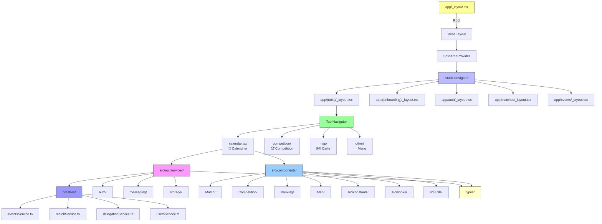
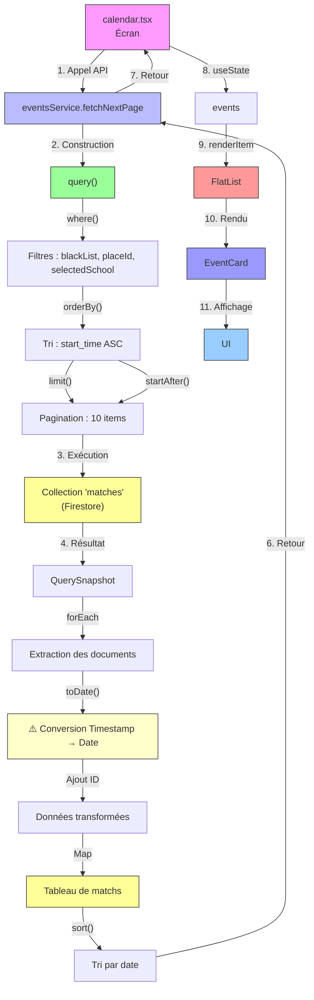
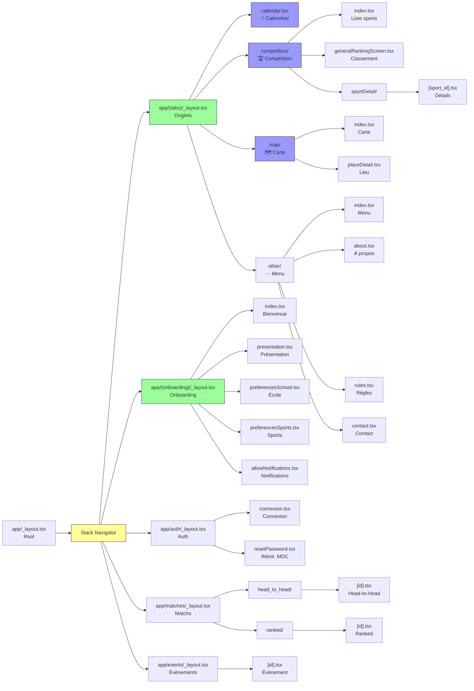
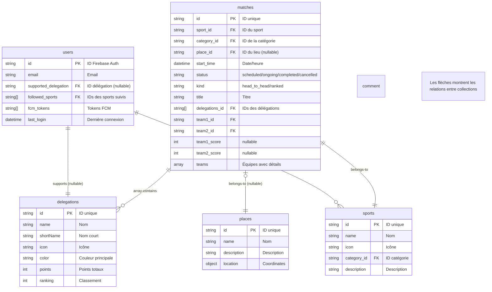

# 🗂️ Structure du Projet - AtlanticApp

> *Comprendre l'arborescence et le rôle de chaque fichier/dossier dans le projet. Conçu pour les débutants.*

---

## 📖 **Sommaire**

1. [Arborescence Complète](#-arborescence-complète)
2. [Structure Détaillée par Dossier](#-structure-détaillée-par-dossier)
3. [Schémas Visuels](#-schémas-visuels)
4. [Fichiers Clés Expliqués](#-fichiers-clés-expliqués)

---

**[← Retour à l'accueil](./Home.md)** | **[Backend Firebase →](./Backend-Firebase.md)**

---

## 🌳 **Arborescence Complète**

Voici **toute la structure** du projet AtlanticApp, avec des emojis pour identifier les types de fichiers :

```
AtlanticApp-mobile/
├── 📁 app/                          # 📱 **Écrans de l'application** (Expo Router)
│   ├── (tabs)/                      # Onglets principaux de l'application
│   │   ├── calendar.tsx             # 📅 Calendrier des matchs (avec pagination et filtres)
│   │   ├── competition/             # 🏆 Section compétition
│   │   │   ├── index.tsx            # Liste des sports
│   │   │   ├── generalRankingScreen.tsx  # Classement général
│   │   │   └── sportDetail/          # Détails d'un sport
│   │   │       └── [sport_id].tsx    # Écran dynamique par sport
│   │   ├── map/                     # 🗺️ Carte interactive
│   │   │   ├── index.tsx            # Carte principale avec marqueurs
│   │   │   └── placeDetail.tsx      # Détails d'un lieu
│   │   └── other/                   # ⋯ Menu
│   │       ├── index.tsx            # Page d'accueil du menu
│   │       ├── about.tsx            # À propos de l'application
│   │       ├── rules.tsx            # Règles de la compétition
│   │       ├── contact.tsx          # Contact
│   │       ├── announcements.tsx    # Annonces
│   │       └── lunch.tsx            # Menu du déjeuner
│   ├── (onboarding)/                # 🎬 Écrans d'onboarding
│   │   ├── index.tsx                # Écran de bienvenue
│   │   ├── presentation.tsx        # Présentation de l'application
│   │   ├── preferencesSchool.tsx   # Sélection de l'école à soutenir
│   │   ├── preferencesSports.tsx   # Sélection des sports à suivre
│   │   └── allowNotifications.tsx  # Autorisation des notifications
│   ├── auth/                        # 🔐 Authentification
│   │   ├── connexion.tsx            # Écran de connexion
│   │   ├── resetPassword.tsx       # Réinitialisation du mot de passe
│   │   └── _layout.tsx              # Layout de l'authentification
│   ├── matches/                     # ⚽ Détails des matchs
│   │   ├── head_to_head/            # Matchs en face-à-face
│   │   │   └── [id].tsx              # Écran dynamique de match head-to-head
│   │   ├── ranked/                  # Matchs classés
│   │   │   └── [id].tsx              # Écran dynamique de match ranked
│   │   └── _layout.tsx              # Layout des matchs
│   ├── events/                      # 🎉 Événements spéciaux
│   │   └── [id].tsx                  # Écran dynamique d'événement
│   ├── +not-found.tsx              # ❌ Page 404
│   └── _layout.tsx                 # 📱 **Layout principal de l'application**
│
├── 📁 src/                          # 🔧 **Code source principal**
│   ├── 📁 api/                      # 🔥 **Services backend**
│   │   └── services/                # Services organisés par domaine
│   │       ├── firestore/           # ⬛ **Services Firestore**
│   │       │   ├── eventsService.ts     # ⭐ Récupération paginée des événements/matches
│   │       │   ├── matchService.ts      # Opérations CRUD sur les matchs
│   │       │   ├── delegationService.ts # Gestion des délégations (écoles)
│   │       │   ├── teamsService.ts      # Gestion des équipes
│   │       │   ├── sportsService.ts     # Gestion des sports
│   │       │   ├── usersService.ts      # Gestion des utilisateurs
│   │       │   ├── rankingService.ts    # Gestion des classements
│   │       │   ├── placeService.ts      # Gestion des lieux
│   │       │   ├── announcementsService.ts
│   │       │   ├── categoryService.ts
│   │       │   └── othersService.ts
│   │       ├── auth/                   # 🔐 **Service d'authentification**
│   │       │   └── authService.ts       # Connexion/déconnexion + sync FCM
│   │       ├── messaging/               # 📬 **Service de messagerie (FCM)**
│   │       │   └── fcmService.ts        # Tokens FCM et abonnements aux topics
│   │       └── storage/                 # 💾 **Stockage local**
│   │           ├── favoriteDelegationService.ts  # Gestion de l'école favorite
│   │           └── supportedSportsService.ts      # Gestion des sports suivis
│   │
│   ├── 📁 components/               # 🧩 **Composants React réutilisables**
│   │   ├── Event/                       # Composants liés aux événements
│   │   │   ├── EventCard.tsx           # Carte d'événement
│   │   │   └── EventItem.tsx           # Élément de liste d'événement
│   │   ├── Match/                       # Composants liés aux matchs
│   │   │   ├── MatchCard.tsx           # Carte de match générique
│   │   │   ├── HeadToHeadMatchCard.tsx # Carte pour matchs face-à-face
│   │   │   └── RankedMatchCard.tsx     # Carte pour matchs classés
│   │   ├── Competition/                 # Composants de compétition
│   │   │   ├── FinalRanking.tsx         # Classement final
│   │   │   ├── GroupRanking.tsx         # Classement par groupe
│   │   │   └── SportItem.tsx            # Élément de sport
│   │   ├── Ranking/                     # Composants de classement
│   │   │   ├── AtlanticupRanking.tsx        # Composant parent
│   │   │   ├── AtlanticupRankingType1.tsx  # Type 1
│   │   │   ├── AtlanticupRankingType2.tsx  # Type 2
│   │   │   └── AtlanticupRankingType3.tsx  # Type 3
│   │   ├── Map/                         # Composants de carte
│   │   │   ├── AnimatedMarker.tsx        # Marqueur animé générique
│   │   │   ├── AndroidAnimatedMarker.tsx # Spécifique Android
│   │   │   └── IosAnimatedMarker.tsx     # Spécifique iOS
│   │   ├── UpdateScore/                 # Composants de mise à jour de score
│   │   │   ├── AtlanticupUpdateScoreType1.tsx
│   │   │   └── AtlanticupUpdateScoreType2.tsx
│   │   ├── ui/                          # Composants UI génériques
│   │   │   ├── IconSymbol.tsx            # Icônes symboles
│   │   │   └── TabBarBackground.tsx      # Fond de la barre d'onglets
│   │   ├── AtlanticupEventItem.tsx      # Élément d'événement Atlanticup
│   │   ├── AtlanticupAnnouncementItem.tsx
│   │   ├── SchoolPicker.tsx             # Sélecteur d'école
│   │   ├── ScreenLoader.tsx             # Composant de chargement
│   │   ├── ScrollingText.tsx            # Texte défilant
│   │   ├── ThemedText.tsx               # Texte avec thème
│   │   ├── ThemedView.tsx               # Vue avec thème
│   │   ├── Collapsible.tsx              # Section repliable
│   │   ├── ParallaxScrollView.tsx      # ScrollView avec effet parallaxe
│   │   └── ExternalLink.tsx              # Lien externe
│   │
│   ├── 📁 constants/                # 📋 **Constantes globales**
│   │   ├── Colors.ts                    # 🎨 Palette de couleurs de l'application
│   │   └── AtlanticupBuildungFeatures.ts  # Feature flags
│   │
│   ├── 📁 hooks/                    # ✅ **Hooks React personnalisés**
│   │   ├── useColorScheme.ts           # Gère le thème clair/sombre
│   │   └── useThemeColor.ts            # Récupère les couleurs selon le thème
│   │
│   └── 📁 utils/                    # 🔧 **Fonctions utilitaires**
│       ├── matchMetadataTranslator.ts   # Traduit les métadonnées des matchs
│       └── pointsPerMatchBySports.ts     # Calcule les points par sport
│
├── 📁 types/                       # 🏷️ **Types TypeScript**
│   ├── models.ts                   # 🎯 Interfaces des modèles métiers (Match, Team, Sport...)
│   ├── enrichedModels.ts           # Types pour les données enrichies
│   └── rawModels.ts                # Types pour les données brutes de Firestore
│
├── 📁 assets/                      # 🎨 **Ressources statiques**
│   ├── images/                     # Images
│   │   └── logo-atlanticup-no-background.png
│   └── fonts/                      # Polices personnalisées
│
├── 📁 firebase-config/             # 🔥 **Configuration Firebase**
│   └── index.ts                    # Config des projets Firebase (test/prod)
│
├── 📁 scripts/                     # 📜 **Scripts utilitaires**
│   └── reset-project.js            # Script de réinitialisation
│
├── 📄 package.json                 # 📦 Dépendances et scripts npm
├── 📄 app.config.js                # ⚙️ Configuration Expo
├── 📄 tsconfig.json                # ⚙️ Configuration TypeScript
├── 📄 README.md                    # 📖 Documentation de base
└── 📄 .env                        # 🌍 Variables d'environnement (NON COMITÉ)
```

---

## 🏗️ **Structure Détaillée par Dossier**

### 📱 **`app/` - Écran de l'Application**

> *Tous les écrans de l'application, organisés avec **Expo Router** (navigation basée sur le système de fichiers).*

**Concept clé** : Avec Expo Router, **la structure des fichiers = les routes de l'application**.

| Fichier/Dossier | Route | Rôle | Technologies |
|----------------|-------|------|--------------|
| `(tabs)/` | `/(tabs)` | Groupe des onglets principaux | Expo Router |
| `(tabs)/calendar.tsx` | `/(tabs)/calendar` | **Affiche le calendrier des matchs** avec pagination et filtres | FlatList, Firestore |
| `(tabs)/competition/` | `/(tabs)/competition` | Section dédiée à la compétition | React Navigation |
| `(tabs)/map/` | `/(tabs)/map` | **Carte interactive** des lieux | react-native-maps |
| `(tabs)/other/` | `/(tabs)/other` | Menu avec infos supplémentaires | - |
| `(onboarding)/` | `/(onboarding)` | **Écrans d'onboarding** (sélection école, sports, notifications) | AsyncStorage |
| `auth/` | `/auth` | Écran de connexion et réinitialisation | Firebase Auth |
| `matches/` | `/matches` | **Détails des matchs** (head-to-head, ranked) | Firestore |
| `events/` | `/events` | Détails des événements spéciaux | Firestore |
| `_layout.tsx` | `/` | **Layout principal** avec barre de navigation | Expo Router |
| `+not-found.tsx` | 404 | Page d'erreur 404 | - |

**💡 Pourquoi Expo Router ?**
- **Zéro configuration** : Pas besoin de configurer manuellement les routes
- **Basé sur les fichiers** : La structure des fichiers définit automatiquement les routes
- **Navigation intuitive** : `router.navigate('/calendar')` pour naviguer
- **Groupes de routes** : `(tabs)`, `(onboarding)` pour organiser les écrans

---

### 🔧 **`src/api/services/` - Couche Backend**

> *Tous les services pour interagir avec Firebase et gérer la logique métier.*

#### 📁 **`firestore/` - Services Firestore**

> *Chaque fichier correspond à une collection Firestore ou un domaine métier.*

| Fichier | Rôle | Fonction principale |
|--------|------|---------------------|
| **eventsService.ts** | ⭐ **Récupération paginée des matchs** | `fetchNextPage({ lastDoc, selectedSchool, blackList, placeId })` |
| **matchService.ts** | CRUD des matchs | `getMatchFromId()`, `updateHeadToHeadMatchScore()` |
| **delegationService.ts** | Gestion des délégations (écoles) | `getAllDelegations()`, `getDelegationFromId()` |
| **teamsService.ts** | Gestion des équipes | `getTeamFromId()` |
| **sportsService.ts** | Gestion des sports | `getAllRawSports()`, `getSportFromId()` |
| **usersService.ts** | Gestion des utilisateurs | `getUserFromUid()`, `updateUser()` |
| **rankingService.ts** | Gestion des classements | `getGeneralRanking()`, `getSportRanking()` |
| **placeService.ts** | Gestion des lieux | `getAllPlaces()`, `getPlaceFromId()` |
| **announcementsService.ts** | Gestion des annonces | `getAllAnnouncements()` |
| **categoryService.ts** | Gestion des catégories | `getAllCategories()` |
| **othersService.ts** | Divers | - |

**💡 Bonnes pratiques** :
- ✅ **Séparation des responsabilités** : Chaque service gère un domaine métier
- ✅ **Réutilisabilité** : Un service peut être utilisé depuis plusieurs écrans
- ✅ **Maintenabilité** : Plus facile de corriger ou améliorer un service isolément

#### 📁 **`auth/` - Authentification**

| Fichier | Rôle | Fonctions |
|--------|------|-----------|
| **authService.ts** | Gestion de la connexion/déconnexion | `logIn()`, `logOut()` |

**Exemple concret** :
```typescript
// Dans authService.ts - La connexion synchronise automatiquement les préférences
export const logIn = async (email: string, password: string) => {
  const userCredential = await auth().signInWithEmailAndPassword(email, password);
  
  // Enregistre le token FCM pour les notifications
  await exportFcmToken();
  
  // Met à jour la date de dernière connexion
  await updateUser(userCredential.user.uid, { last_login: new Date() });
  
  // Synchronise les préférences utilisateur
  const userData = await getUserFromUid(userCredential.user.uid);
  await setLocalFavoriteDelegation(userData.supported_delegation);
  await subscribeToDelegation(userData.supported_delegation);
  await setLocalSupportedSports(userData.followed_sports);
  await subscribeToSports(userData.followed_sports);
  
  return userCredential.user.uid;
};
```

#### 📁 **`messaging/` - Notifications Push (FCM)**

| Fichier | Rôle | Fonctions |
|--------|------|-----------|
| **fcmService.ts** | Gestion des tokens FCM et abonnements | `getFcmToken()`, `subscribeToDelegation()`, `subscribeToSports()` |

**Fonctionnalités clés** :
- Récupération et sauvegarde du **token FCM** (identifiant unique de l'appareil)
- **Abonnement aux topics** (canaux de notification : `delegation_imt`, `sport_football`)
- Synchronisation automatique lors de la connexion/déconnexion

#### 📁 **`storage/` - Stockage Local**

| Fichier | Rôle | Fonctions |
|--------|------|-----------|
| **favoriteDelegationService.ts** | Sauvegarde de l'école favorite | `getLocalFavoriteDelegation()`, `setLocalFavoriteDelegation()` |
| **supportedSportsService.ts** | Sauvegarde des sports suivis | `getLocalSupportedSports()`, `setLocalSupportedSports()` |

**💡 Pourquoi AsyncStorage ?**
AsyncStorage est le système de **stockage local persistant** de React Native, similaire à localStorage dans les navigateurs, mais **asynchrone**.

---

### 🧩 **`src/components/` - Composants Réutilisables**

> *Composants UI qui peuvent être utilisés dans plusieurs écrans. Organisés par domaine fonctionnel.*

#### 📁 **`Match/` - Composants de Matchs**

| Composant | Props | Description |
|-----------|-------|-------------|
| **MatchCard.tsx** | `match: Match` | Carte affichant les infos basiques d'un match |
| **HeadToHeadMatchCard.tsx** | `match: Match` | Carte pour les matchs en face-à-face (2 équipes) |
| **RankedMatchCard.tsx** | `match: Match` | Carte pour les matchs classés (plusieurs équipes) |

#### 📁 **`Competition/` - Composants de Compétition**

| Composant | Props | Description |
|-----------|-------|-------------|
| **FinalRanking.tsx** | `ranking: Team[]` | Affiche le classement final |
| **GroupRanking.tsx** | `groups: Group[]` | Affiche les classements par groupe |
| **SportItem.tsx** | `sport: Sport` | Affiche un sport dans une liste |

#### 📁 **`Ranking/` - Composants de Classement**

| Composant | Props | Description |
|-----------|-------|-------------|
| **AtlanticupRanking.tsx** | `type: RankingType` | Composant parent pour les différents types |
| **AtlanticupRankingType1.tsx** | `data: Team[]` | Classement simple |
| **AtlanticupRankingType2.tsx** | `data: Team[]` | Classement avec groupes |
| **AtlanticupRankingType3.tsx** | `data: Team[]` | Classement personnalisé |

#### 📁 **`Map/` - Composants de Carte**

| Composant | Plateforme | Rôle |
|-----------|-----------|------|
| **AnimatedMarker.tsx** | Générique | Marqueur animé sur la carte |
| **AndroidAnimatedMarker.tsx** | Android | Implémentation spécifique Android |
| **IosAnimatedMarker.tsx** | iOS | Implémentation spécifique iOS |

**💡 Pourquoi des implémentations séparées ?**
React Native gère différemment les **animations** sur Android et iOS. Ces fichiers contiennent le code **spécifique à chaque plateforme** pour des performances optimales.

---

### 📋 **`src/constants/` - Constantes Globales**

| Fichier | Contenu | Exemple |
|--------|---------|---------|
| **Colors.ts** | Palette de couleurs | `primary: '#1d4966'` |
| **AtlanticupBuildungFeatures.ts** | Feature flags | `ENABLE_NEW_RANKING: true` |

**Exemple** (Colors.ts) :
```typescript
export const Colors = {
  primary: '#1d4966',      // Bleu principal (AtlanticApp)
  secondary: '#4a90e2',    // Bleu secondaire
  background: '#ffffff',   // Fond blanc
  text: '#333333',         // Texte foncé
  textLight: '#666666',    // Texte clair
  success: '#2ecc71',      // Vert succès
  warning: '#f39c12',      // Orange avertissement
  error: '#e74c3c',        // Rouge erreur
};
```

---

### ✅ **`src/hooks/` - Hooks Personnalisés**

| Hook | Rôle | Retour |
|------|------|--------|
| **useColorScheme.ts** | Gère le thème clair/sombre de l'appareil | `'light'` \| `'dark'` |
| **useThemeColor.ts** | Récupère les couleurs en fonction du thème | Couleur adaptée |

**Exemple** :
```typescript
import { useColorScheme, useThemeColor } from '@/src/hooks';

const MyComponent = () => {
  const colorScheme = useColorScheme();
  const textColor = useThemeColor({ light: '#000', dark: '#fff' });
  
  return <Text style={{ color: textColor }}>Hello World</Text>;
};
```

---

### 🔧 **`src/utils/` - Fonctions Utilitaires**

| Fichier | Rôle |
|--------|------|
| **matchMetadataTranslator.ts** | Traduit les métadonnées des matchs (noms de statuts, etc.) |
| **pointsPerMatchBySports.ts** | Calcule les points attribués selon le sport et le type de match |

---

### 🏷️ **`types/` - Types TypeScript**

> *Définition de tous les types utilisés dans l'application.*

| Fichier | Contenu | Exemple |
|--------|---------|---------|
| **models.ts** | Interfaces des modèles métiers | `interface Match`, `interface Team` |
| **rawModels.ts** | Types pour les données brutes de Firestore | `interface RawMatch { start_time: Timestamp; }` |
| **enrichedModels.ts** | Types pour les données enrichies (après transformation) | `interface EnrichedMatch { start_time: Date; }` |

**Exemple** (models.ts) :
```typescript
// Modèle d'un match
interface Match {
  id: string;
  category: string;           // Catégorie (masculin, féminin, mixte)
  description: string;
  place_id: string | null;    // ID du lieu (nullable)
  sport_id: string;          // ID du sport
  start_time: Date;         // Date de début (après conversion Timestamp → Date)
  status: string;            // Statut: scheduled, ongoing, completed, cancelled
  team1_id: string;
  team2_id: string;
  team1_score: number | null;
  team2_score: number | null;
  kind: string;              // Type: head_to_head, ranked
  teams: any;                // Équipes participantes avec détails
  title: string;
}

// Modèle d'une équipe
interface Team {
  id: string;
  name: string;
  delegation_id: string;     // ID de l'école
  score: number | number[]; // Score (simple ou tableau pour ranked)
}

// Modèle d'une délégation (école)
interface Delegation {
  id: string;
  name: string;
  shortName: string;
  icon: string;
  color: string;
  secondaryColor: string;
  points: number;
  ranking: number;
}
```

---

## 🎨 **Schémas Visuels**

### 📊 **Architecture Globale de l'Application**



### 🔄 **Flux de Données : De Firestore à l'Écran (Calendrier)**



**⚠️ Point critique** : La conversion **Timestamp → Date** dans `eventsService.ts` est **essentielle** :
```typescript
start_time: (doc.data().start_time as any)?.toDate?.() ?? null
```

### 🗺️ **Navigation avec Expo Router**



### 🔗 **Relations entre les Collections Firestore**



---

## 📚 **Fichiers Clés Expliqués**

### 🎯 **eventsService.ts** - Le Cœur du Calendrier

> *Ce service est **central** pour l'affichage du calendrier. Il gère la **pagination**, le **filtrage** et la **transformation des données**.*

**Fonction principale** : `fetchNextPage({ lastDoc, selectedSchool, blackList, placeId })`

```typescript
// app/(tabs)/calendar.tsx - Utilisation
await fetchNextPage({
  lastDoc: lastDoc,                    // Pour la pagination (null = 1ère page)
  selectedSchool: seeSchoolOnly ? selectedTeam : null,  // Filtre par école
  blackList: ['completed', 'cancelled'],  // Exclut les matchs terminés/annulés
  placeId: null                       // Filtre par lieu (optionnel)
});
```

**Fonctionnement détaillé** :

1. **Construction de la requête** :
   ```typescript
   let qMatches = query(collection(db, "matches"));
   
   // Filtre par statut (blackList)
   if (blackList && blackList.length > 0) {
     qMatches = query(qMatches, where("status", "not-in", blackList));
   }
   
   // Tri par date
   qMatches = query(qMatches, orderBy("start_time", "asc"));
   
   // Pagination
   if (lastDoc) {
     qMatches = query(qMatches, startAfter(lastDoc));
   }
   
   // Filtre par école
   if (selectedSchool) {
     qMatches = query(qMatches, where("delegations_id", "array-contains", selectedSchool));
   }
   
   // Limite
   qMatches = query(qMatches, limit(PAGE_SIZE));
   ```

2. **Exécution et transformation** :
   ```typescript
   const snap = await getDocs(qMatches);
   const docsMap = new Map();
   
   snap.docs.forEach((doc) => {
     docsMap.set(doc.id, {
       ...doc.data(),
       id: doc.id,
       start_time: (doc.data().start_time as any)?.toDate?.() ?? null  // ⚠️ CRITIQUE
     });
   });
   
   return {
     docs: Array.from(docsMap.values()),
     lastDoc: snap.docs[snap.docs.length - 1]
   };
   ```

**⚠️ Points critiques** :
- **`toDate()`** : Convertit les `Timestamp` Firebase en objets `Date` JavaScript
- **`array-contains`** : Filtre les documents où un tableau contient une valeur
- **`startAfter(lastDoc)`** : Permet la **pagination infinie**

---

### 🎯 **fcmService.ts** - Gestion des Notifications

> *Service qui gère tout ce qui concerne les **notifications push** via Firebase Cloud Messaging.*

**Concepts clés** :
- **Token FCM** : Identifiant unique de l'appareil (`cLQ2aBcD...`)
- **Topic** : Canal de notification (`delegation_imt`, `sport_football`)
- **Subscription** : Abonnement à un topic pour recevoir ses notifications

**Fonctions principales** :

| Fonction | Description | Plateforme |
|----------|-------------|-----------|
| `checkNotificationPermission()` | Vérifie et requiert les permissions | Android & iOS |
| `getFcmToken(uid)` | Récupère le token FCM | Android & iOS |
| `exportFcmToken()` | Enregistre le token dans Firestore | - |
| `subscribeToDelegation(delegationId)` | Abonne à un topic d'école | - |
| `subscribeToSports(sportsId[])` | Abonne à des topics de sports | - |

**Exemple** : Abonnement aux notifications dans l'onboarding :
```typescript
// Dans allowNotifications.tsx ou authService.ts
await subscribeToDelegation(user.supported_delegation);
await subscribeToSports(user.followed_sports);
```

---

### 🎯 **calendar.tsx** - Écran Principal

> *Écran affichant la liste des matchs avec **pagination**, **filtres** et **animations**.*

**État géré** :
```typescript
const [events, setEvents] = useState<any[]>([]);           // Liste des matchs
const [loading, setLoading] = useState(false);             // État de chargement
const [seeSchoolOnly, setSeeSchoolOnly] = useState(false); // Filtre "mon école"
const [selectedTeam, setSelectedTeam] = useState<string | null>(null); // École sélectionnée
const [lastDoc, setLastDoc] = useState<QueryDocumentSnapshot | null>(null); // Pour pagination
const [hasMore, setHasMore] = useState(true);              // Y a-t-il plus de données ?
const [refreshing, setRefreshing] = useState(false);     // Rafraîchissement
```

**Fonctionnalités** :
- ✅ **Pagination infinie** avec `FlatList` + `onEndReached`
- ✅ **Filtre par école** (`seeSchoolOnly`)
- ✅ **Blacklist des statuts** (exclut les matchs `completed`, `cancelled`)
- ✅ **Animation du header** avec `Animated`
- ✅ **Pull-to-refresh** avec `RefreshControl`
- ✅ **Chargement avec loader**

---

## 🔄 **Navigation**

```
┌─────────────────────────────────────────────────────────────┐
│                 STRUCTURE DU PROJET                            │
├─────────────────────────────────────────────────────────────┤
│  [Arborescence]  │  [Dossiers]  │  [Schémas]  │  [Fichiers Clés] │
└─────────────────────────────────────────────────────────────┘
```

**[← Retour à l'accueil](./Home.md) | [Backend Firebase →](./Backend-Firebase.md)**

---

*Dernière mise à jour : 13 juin 2026*
*Cette page explique la structure du projet AtlanticApp pour les débutants.*
